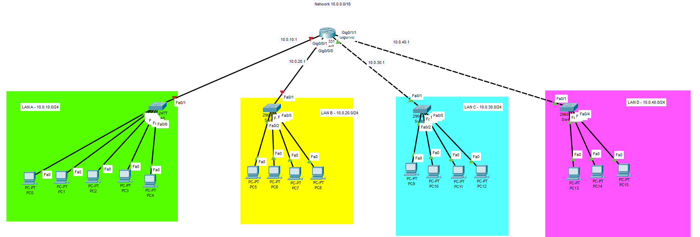

# Network Project Documentation

**Project Name:** Basic Routing Lab 
**Version:** 1.0  
**Author:** Nicholas Williams  
**Date Created:**  July 29th 2026
**Last Updated:**  
**Status:**  Completed

---

# 1. Project Overview

### Objective
This project demonstrates the fundamentals of routing by connecting two independent local area networks (LANs) using a single router. Each LAN contains end devices connected through a Layer 2 switch, with the router providing the Layer 3 routing function between the networks.

### Goals
- Configure router interfaces with IP addresses
- Configure end devices with static IP addresses
- Understand subnet separation
- Configure and verify default gateways
- Test connectivity between different networks

---

# 2. Network Topology
The network consists of four separate LANs (LAN A–D), with each LAN using a star topology where end devices connect to a central Layer 2 switch. Each switch then connects to an interface on the router.

### Advantages
- Each physical LAN is its own broadcast domain, limiting broadcast traffic to local devices
- Simple design that is easy to configure, manage, and troubleshoot

### Drawbacks / Limitations
- The router is a single point of failure. If it goes offline, communication between all LANs is lost
- Each switch is a single point of failure for its connected LAN
- 

---

# 3. Physical Layout

---

### Devices

| Quantity | Device | Model | Purpose |
|----------|--------|-------|---------|
| 1 | Router | Cisco ISR 4331 | Provides Layer 3 routing between LAN A–D and serves as the default gateway for each subnet |
| 4 | Switches | Cisco Catalyst 2960 | Provides Layer 2 connectivity for each individual LAN |
| 16 | PCs | Generic End Devices | Simulate user devices and validate network connectivity |

---

# 4. Logical Network Design

### IP Addressing Plan

| LAN | Network | Network Address | Subnet Mask | Default Gateway |
|------|---------|----------------|-------------|-----------------|
| LAN A | User Network A | 10.0.10.0/24 | 255.255.255.0 | 10.0.10.1 |
| LAN B | User Network B | 10.0.20.0/24 | 255.255.255.0 | 10.0.20.1 |
| LAN C | User Network C | 10.0.30.0/24 | 255.255.255.0 | 10.0.30.1 |
| LAN D | User Network D | 10.0.40.0/24 | 255.255.255.0 | 10.0.40.1 |
---

# 5. Routing Design
The network uses a single Cisco 2811 router to provide Layer 3 routing between four physically separated LAN networks. Each LAN is assigned its own subnet within the 10.0.0.0/16 address space, and each router interface is configured as the default gateway for its connected LAN.

No static or dynamic routing protocols are required because all networks are directly connected to the router. The router automatically adds connected routes to its routing table when the interfaces are configured and enabled.

Traffic between LANs is forwarded through the router based on its routing table, allowing communication between the four separate network segments.

## Routing Tables Summary

## Router Interface Configuration

| Router Interface | IP Address | Subnet Mask | Connected Network | Route Type |
|-----------------|------------|-------------|-------------------|------------|
| Ethernet1/0 | 10.0.10.1 | 255.255.255.0 (/24) | 10.0.10.0/24 (LAN A) | Connected |
| Ethernet1/1 | 10.0.20.1 | 255.255.255.0 (/24) | 10.0.20.0/24 (LAN B) | Connected |
| Ethernet1/2 | 10.0.30.1 | 255.255.255.0 (/24) | 10.0.30.0/24 (LAN C) | Connected |
| Ethernet1/3 | 10.0.40.1 | 255.255.255.0 (/24) | 10.0.40.0/24 (LAN D) | Connected |

---

# 6. Future Improvements

The following improvements will extend the basic routing design into a more resilient enterprise network environment.

| Improvement | Description |
|---|---|
| Redundant Switching | Add additional switches and redundant links to improve network availability and provide backup paths during failures. |
| Spanning Tree Protocol (STP) | Implement Layer 2 loop prevention to maintain a stable switching topology when redundant connections are introduced. |
| EtherChannel | Combine multiple physical switch links into a single logical connection to increase bandwidth and provide link redundancy. |
