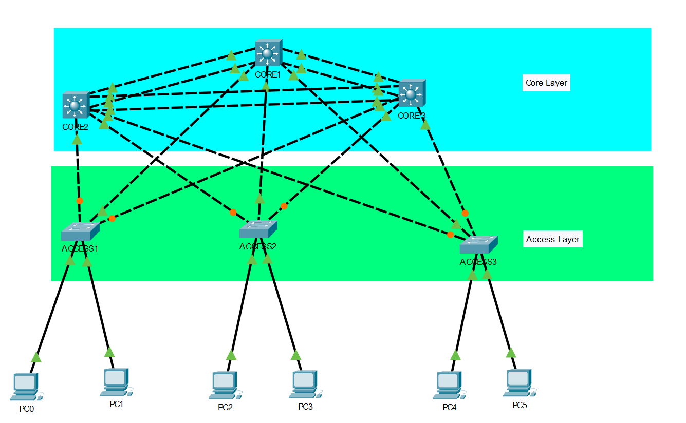
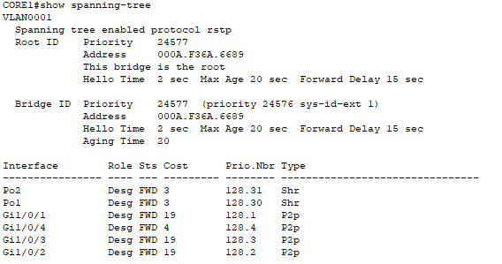
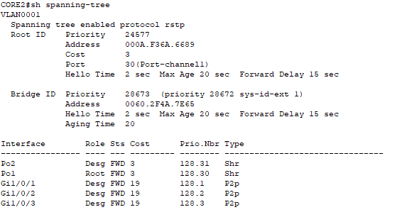
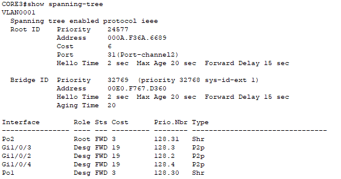
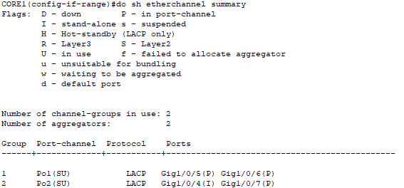
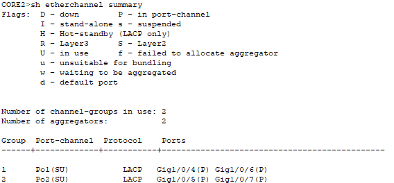
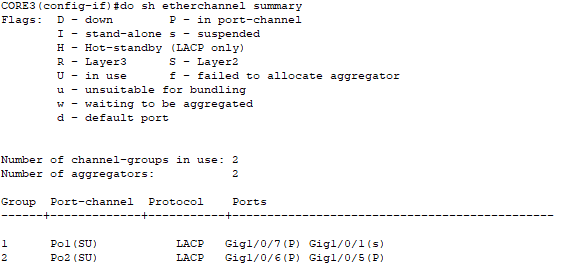

# Project Documentation

**Project Name:** 02-Redundant-Switching-STP-EtherChannel-Lab  
**Version:** 1.0  
**Author:** Nicholas Williams  
**Date Created:** July 29th 2026  
**Last Updated:** July 29th 2026  
**Status:** Complete  

---

# 1. Project Overview

## Objective

Design and implement a redundant Layer 2 switching network using multiple switches, Spanning Tree Protocol (STP), and EtherChannel.

The project demonstrates how enterprise networks maintain high availability by preventing switching loops and providing redundant network paths.

## Goals

- Design a redundant Layer 2 switching topology.
- Configure STP for loop prevention.
- Configure a Root Bridge for predictable traffic flow.
- Configure EtherChannel for link aggregation.
- Test network failover behavior.

---

# 2. Network Topology

## Topology Type

A redundant mesh topology was implemented to simulate an enterprise switching environment.

Multiple switch connections provide alternate paths between devices. STP prevents Layer 2 loops by placing redundant paths into a blocking state, while EtherChannel combines multiple physical links into a single logical connection.

## Advantages

- Provides Layer 2 redundancy.
- Prevents switching loops.
- Allows automatic recovery after link failures.
- Increases bandwidth using EtherChannel.

## Limitations

- Requires additional hardware and cabling.
- STP may block redundant links.
- Larger Layer 2 networks are more complex to troubleshoot.
- No Layer 3 gateway redundancy is implemented.

---

# 3. Physical Layout



## Devices

| Device | Model | Purpose |
|---|---|---|
| Core1 | Cisco 3650 Layer 3 Switch | Primary Root Bridge |
| Core2 | Cisco 3650 Layer 3 Switch | Secondary Root Bridge |
| Core3 | Cisco 3650 Layer 3 Switch | Redundant Core Switch |
| Access1 | Cisco 2960 Switch | Access Layer Switch |
| Access2 | Cisco 2960 Switch | Access Layer Switch |
| Access3 | Cisco 2960 Switch | Access Layer Switch |
| PC1-PC10 | End Devices | Connectivity Testing |
---

# 4. Switching Design

The network uses a Layer 2 switching design with redundant connections between switches.

STP provides loop prevention, while EtherChannel provides increased bandwidth and link redundancy.

---

# Spanning Tree Protocol (STP)

STP maintains a loop-free Layer 2 topology by selecting the lowest-cost path to the root bridge and blocking redundant paths.

## STP Functions

- The switch with the lowest Bridge ID becomes the root bridge.
- Selects the best forwarding paths.
- Blocks redundant links.
- Restores connectivity after failures.

---

## STP Configuration

SW1 is configured as the primary Root Bridge.

### Root Bridge Configuration

```
spanning-tree vlan 1 priority 4096
```

### Verification

```
show spanning-tree root
```

Expected Result:

```
This bridge is the root
```





---

## STP Port Roles

| Port Role | Description |
|---|---|
| Root Port | Lowest-cost path toward the Root Bridge |
| Designated Port | Forwarding port for a network segment |
| Alternate Port | Backup path placed into blocking state |
| Disabled Port | Administratively shut down port |

---

# EtherChannel Design

EtherChannel combines multiple physical Ethernet links into a single logical link called a Port Channel. This increases bandwidth, provides link redundancy, and simplifies STP operation.

STP and EtherChannel work together by:

- STP prevents Layer 2 loops by selecting the best path to the root bridge and blocking redundant paths.
- Without EtherChannel, STP treats each physical link separately and may block unused links to prevent loops.
- With EtherChannel, STP views the bundled links as one logical connection, allowing all member links to remain active.
- If redundant EtherChannels create a loop, STP blocks the redundant Port Channel rather than individual physical links.

---

## EtherChannel Protocol

This lab uses Link Aggregation Control Protocol (LACP).

| Protocol | Standard | Configuration |
|---|---|---|
| LACP | IEEE 802.3ad | `channel-group X mode active` |
| PAgP | Cisco Proprietary | `channel-group X mode desirable` |

---

## EtherChannel Configuration

Example:

```
interface range gigabitEthernet0/1-2
switchport mode trunk
channel-group 1 mode active

exit

interface port-channel 1
switchport nonegotiate

```

---

## Port Channel Assignments

| Port Channel | Connection | Interfaces | Protocol | Purpose |
|---|---|---|---|---|
| Po1 | CORE1 ↔ CORE2 | CORE1: Gi1/0/5-6<br>CORE2: Gi1/0/4-6 | LACP | Redundant core switch connection |
| Po2 | CORE1 ↔ CORE3 | CORE1: Gi1/0/4, Gi1/0/7<br>CORE3: Gi1/0/6, Gi1/0/5 | LACP | Redundant core switch connection |
| Po2 | CORE2 ↔ CORE3 | CORE2: Gi1/0/5, Gi1/0/7<br>CORE3: Gi1/0/7, Gi1/0/1 | LACP | Redundant core switch connection |

---

# EtherChannel Verification
```
show etherchannel summary
```

Core 1  



Core 2  


Core 3  



## Verify Port Channel Interfaces

```
show interfaces port-channel
```

---

# Switching Failover Testing

## Test 1: EtherChannel Link Failure

### Procedure

1. Disable one physical interface in an EtherChannel.
2. Verify the Port Channel remains active.
3. Confirm connectivity remains available.

### Result

- EtherChannel remains operational.
- Traffic uses remaining links.
- No STP recalculation occurs.

---

## Test 2: STP Path Failure

### Procedure

1. Disconnect an active Layer 2 connection.
2. Observe STP recalculation.
3. Verify a blocked path transitions to forwarding.

### Result

- STP selects an alternate path.
- Connectivity is restored automatically.

---

# Future Improvements

The following improvements will extend the switching infrastructure into a more scalable enterprise network environment.

| Improvement | Description |
|---|---|
| VLAN Segmentation | Separate devices into logical broadcast domains to improve organization and security. |
| Trunking | Configure 802.1Q trunk links to transport multiple VLANs between switches. |
| Inter-VLAN Routing | Enable communication between VLANs using Layer 3 routing. |