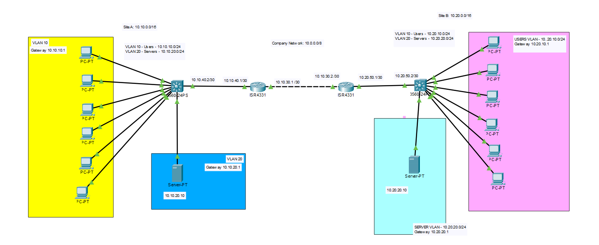

# Network Project Documentation

**Project Name:** 02-VLAN-DHCP-MultiSite-Lab  
**Version:** 1.0  
**Author:** Nicholas Williams  
**Date Created:**  July 29th 2026  
**Last Updated:**  July 29th 2026  
**Status:** Complete  

---

# 1. Project Overview

### Objective
Design and implement a two-site network that demonstrates VLAN segmentation, inter-VLAN routing, DHCP services, and static routing between sites. Each site consists of a router and a Layer 3 switch, with separate VLANs for users and servers. The project focuses on building a functional routed network that allows devices to communicate both within and between sites.

### Goals
- Separate user and server devices into different VLANs.
- Provide automatic IP address assignment using a DHCP server located in each site's server VLAN.
- Configure Switch Virtual Interfaces (SVIs).
- Enable communication between both sites using static routes.
- Ensure all hosts can reach local and remote network resources.

---

# 2. Network Topology

### Topology Type

- A star topology was selected because it provides a simple and organized network design. Centralizing connectivity through the Layer 3 switch makes the network easier to configure, troubleshoot, and expand.

### Why this topology?
Each site uses a star topology, where end devices connect to a central Layer 3 switch. The Layer 3 switch acts as the central point for local network communication, providing VLAN connectivity and inter-VLAN routing between the user and server networks.
The two sites are connected using a routed connection between their respective routers. Static routes are configured on each router to allow communication between the networks at both locations.

### Advantages
- Simple design that is easy to understand and troubleshoot.
- Centralized network management through the Layer 3 switch.

### Drawbacks / Limitations
- The single point of failures for each site, only one router and one layer 3 switch
- No redundancy
- Static routing requires manual updates

---

# 3. Physical Layout

---

### Devices

| Device | Model | Purpose |
|--------|-------|---------|
| R1 | Cisco ISR 4331 | Site A WAN Router |
| R2 | Cisco ISR 4331 | Site B WAN Router |
| SW1 | Cisco 3560 | Site A Layer 3 Switch |
| SW2 | Cisco 3560 | Site B Layer 3 Switch |

---

# 4. Logical Network Design

### VLANs Site A
| VLAN ID | Name | Purpose |
|---------|------|---------|
| 10 | Users | Client workstations and user devices |
| 20 | Servers | DHCP servers and server resources |

### VLANs Site B
| VLAN ID | Name | Purpose |
|---------|------|---------|
| 10 | Users | Client workstations and user devices |
| 20 | Servers | DHCP servers and server resources |

---

### IP Addressing Plan
|  Site  | Network | VLAN | Network Address | Subnet Mask | Default Gateway |
|--------|---------|-------|----------------|-------------|-----------------|
| Site A | Users   | VLAN 10 | 10.10.10.0/24| 255.255.255.0| 10.10.10.1|
| Site A | Servers | VLAN 20 | 10.10.20.0/24| 255.255.255.0| 10.10.20.1|
| Site B | Users   | VLAN 10 | 10.20.10.0/24| 255.255.255.0| 10.20.10.1|
| Site B | Servers | VLAN 20 | 10.20.20.0/24| 255.255.255.0| 10.20.20.1|

---

### WAN Links
| Connection | Device Interfaces | Network Address | Subnet Mask | Interface IP Addresses |
|---|---|---|---| ---|
| Site A Router ↔ Site B Router | R1 Gig0/0/0 ↔ R2 Gig0/0/0 | 10.10.30.0/30| 255.255.255.252| R1: 10.10.30.1 / R2: 10.10.30.2 |

---

# 5. Routing Design
The network uses static routing between sites, with Layer 3 switches responsible for local VLAN routing and routers responsible for forwarding traffic between sites. Each Layer 3 switch uses a default route pointing toward its local router, while routers use static routes to reach remote VLAN networks.

## Routing Tables Summary

| Traffic | Routing Path |
|---|---|
| Site A User VLAN → Site A Server VLAN | SW1 performs inter-VLAN routing |
| Site A → Site B networks | SW1 → R1 → R2 → SW2 |
| Site B User VLAN → Site B Server VLAN | SW2 performs inter-VLAN routing |
| Site B → Site A networks | SW2 → R2 → R1 → SW1 |

### R1 - Site A Router

| Destination Network | Route Type | Purpose |
|---|---|---|
| 10.10.10.0/24 | Static | Site A User VLAN |
| 10.10.20.0/24 | Static | Site A Server VLAN |
| 10.10.30.0/30 | Connected | WAN link to R2 |
| 10.10.40.0/30 | Connected | Link to SW1 |
| 10.20.10.0/24 | Static | Site B User VLAN |
| 10.20.20.0/24 | Static | Site B Server VLAN |
| 10.20.50.0/30 | Static | Link to SW2 |

### R2 - Site B Router

| Destination Network | Route Type | Purpose |
|---|---|---|
| 10.10.10.0/24 | Static | Site A User VLAN |
| 10.10.20.0/24 | Static | Site A Server VLAN |
| 10.10.30.0/30 | Connected | WAN link to R1 |
| 10.10.40.0/30 | Static | Link to SW1 |
| 10.20.10.0/24 | Static | Site B User VLAN |
| 10.20.20.0/24 | Static | Site B Server VLAN |
| 10.20.50.0/30 | Connected | Link to SW2 |

---

# 6. Layer 3 Design
The Layer 3 switches provide local routing functionality within each site. Switch Virtual Interfaces (SVIs) act as the default gateways for the User and Server VLANs, allowing communication between VLANs. Each Layer 3 switch uses a default route to forward traffic destined for remote networks toward its local router.

### SW1 - Site A Layer 3 Switch
| Destination Network | Route Type | Purpose |
|---|---|---|
| 10.10.10.0/24 | Connected | Site A User VLAN |
| 10.10.20.0/24 | Connected | Site A Server VLAN |
| 10.10.40.0/30 | Connected | Link to R1 |
| 0.0.0.0/0 | Static | Forward remote traffic |

### SVIs
| VLAN | Interface | Gateway |
|-------|-----------|----|
| Users| vlan 10| 10.10.10.1|
| Servers| vlan 20| 10.10.20.1|

    interface Vlan10
    ip helper-address 10.10.20.10

## SW2 - Site B Layer 3 Switch
| Destination Network | Route Type | Purpose |
|---|---|---|
| 10.20.10.0/24 | Connected | Site B User VLAN |
| 10.20.20.0/24 | Connected | Site B Server VLAN |
| 10.20.50.0/30 | Connected | Link to R2 |
| 0.0.0.0/0 | Static | Forward remote traffic |
### SVIs
| VLAN | Interface | Gateway |
|-------|-----------|----|
| Users| vlan 10| 10.20.10.1|
| Servers| vlan 20| 10.20.20.1|

    interface Vlan10
    ip helper-address 10.20.20.10

---
# 7. Services
Each site uses a dedicated DHCP server located within the local Server VLAN. The DHCP servers provide automatic IP address assignment for client devices within their respective site.

The Layer 3 switches route DHCP traffic between VLANs and forward DHCP requests from the User VLAN to the DHCP server using DHCP relay functionality.

## DHCP Site A
DHCP Server: 10.10.20.10
Subnet Mask: 255.255.255.0
Default Gateway: 10.10.20.1

DHCP Pool: Users VLAN10
Default Gateway: 10.10.10.1
Start Address Pool: 10.10.10.100
Subnet Mask: 255.255.255.0

## DHCP Site B
DHCP Server: 10.20.20.10
Subnet Mask: 255.255.255.0
Default Gateway: 10.20.20.1

DHCP Pool: Users VLAN10
Default Gateway: 10.20.10.1
Start Address Pool: 10.20.10.100
Subnet Mask: 255.255.255.0

# 8. Troubleshooting Log

## Issue 1: Inter-VLAN Communication Failure

### Problem
Devices within the same site were unable to communicate between User and Server VLANs.

### Investigation
- Verified VLAN configuration on Layer 3 switches.
- Checked SVI status and IP addressing.
- Tested connectivity using ping commands.
- Reviewed routing tables using `show ip route`.

### Root Cause
The required Layer 3 routing configuration was incomplete.

### Resolution
- Enabled Layer 3 routing functionality using `ip routing`
- Verified SVI configuration.
- Confirmed connected routes appeared in the routing table.

### Lesson Learned
Layer 3 switches require properly configured SVIs and routing enabled before VLANs can communicate.

## Issue 2: Site-to-Site Communication Failure

### Problem
Devices at Site A could not communicate with devices at Site B.

### Investigation
- Tested router-to-router connectivity.
- Reviewed routing tables on R1 and R2.
- Verified WAN interface configuration.
- Checked static route entries.

### Root Cause
Static routes were missing or incorrectly configured.
### Resolution
- Added static routes for remote site networks.
- Verified routes appeared as static (`S`) entries.
- Confirmed end-to-end connectivity using ping tests.

### Lesson Learned
Routers require explicit knowledge of remote networks when using static routing.

---

# 9. Future Improvements
The current network design provides basic site-to-site connectivity, VLAN segmentation, inter-VLAN routing, DHCP services, and static routing. The following improvements would increase scalability, redundancy, and resiliency.
## Add Access Layer Switches
Additional access switches could be introduced at each site to support more end devices and create a more scalable network architecture.

### Benefits
- Supports additional users and devices.
- Separates access-layer connectivity from Layer 3 routing functions.
- Allows centralized management of multiple access switches.
- Provides a design closer to enterprise network architectures.

### Additional Considerations
- Configure trunk links between access switches and Layer 3 switches.
- Implement Spanning Tree Protocol (STP) to prevent switching loops.
- Consider port security and VLAN management.

## Implement Redundant Core Routers with OSPF
The single router at each site could be replaced with redundant routers running OSPF to provide dynamic routing and improved availability.

### Benefits
- Removes single points of failure.
- Automatically adapts to network topology changes.
- Provides dynamic route discovery between sites.
- Allows multiple paths for traffic if additional links are added.

### Additional Considerations
- Configure OSPF areas and network advertisements.
- Implement router redundancy protocols where appropriate.
- Design redundant WAN connections between sites.
- Monitor routing changes and convergence times.
---

