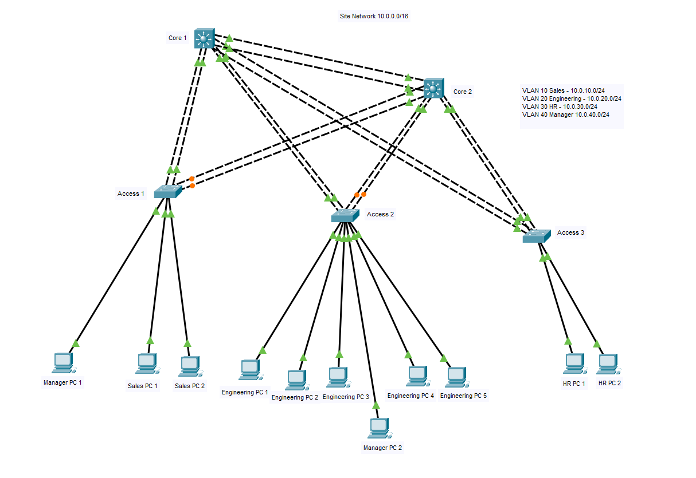
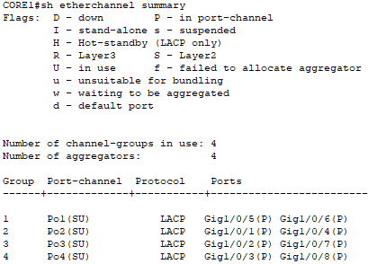
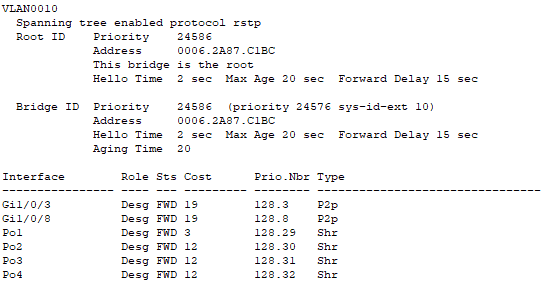
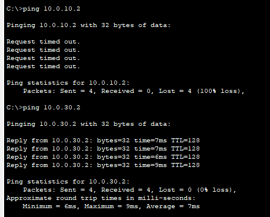
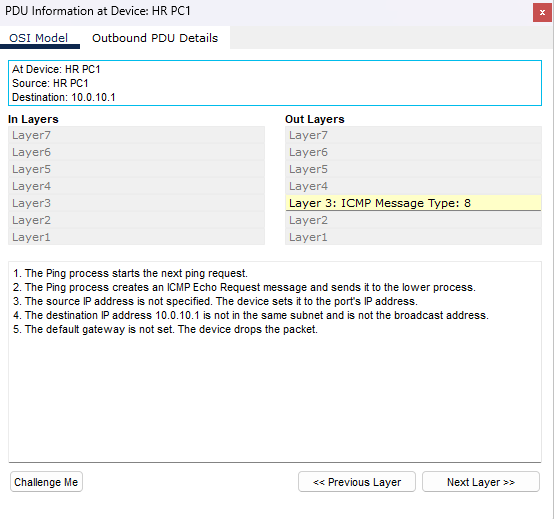

**Project Name:** 03-VLAN-Trunking-Lab
**Version:** 1.0  
**Author:** Nicholas Williams  
**Date Created:** July 29th 2026  
**Last Updated:** July 29th 2026  
**Status:** Complete

## Objective

Design and implement a Layer 2 switching network using Virtual Local Area Networks (VLANs) and IEEE 802.1Q trunking.

This project demonstrates how enterprise networks use VLANs to separate broadcast domains while allowing multiple VLANs to traverse between switches using a single physical trunk connection.

## Goals

- Create multiple VLANs
- Assign switch ports to specific VLANs.
- Configure trunk links between switches.
- Verify VLAN communication across multiple switches.
- Demonstrate Layer 2 isolation between VLANs.

---

# 2. Network Topology

## Topology Type

A two-switch Layer 2 topology was implemented to simulate a departmental network environment.

VLANs are used to logically separate users into different broadcast domains, while an 802.1Q trunk link allows multiple VLANs to communicate across switches.

## Advantages

- Reduces unnecessary broadcast traffic.
- Improves network security through segmentation.
- Allows logical grouping of users independent of physical location.
- Provides a scalable foundation for larger enterprise networks.

## Limitations

- Devices in different VLANs cannot communicate without Layer 3 routing.
- VLAN configurations must be consistent between switches.
- Larger VLAN environments require additional management and documentation.

---

# 3. Physical Layout



## Devices

| Device | Model | Purpose |
|---|---|---|
| CORE1 | Cisco 3560 Layer 3 Switch | Primary Core Switch |
| CORE2 | Cisco 3560 Layer 3 Switch | Secondary Core Switch |
| ACCESS1 | Cisco 2960 Switch | Access Layer Switch |
| ACCESS2 | Cisco 2960 Switch | Access Layer Switch |
| ACCESS3 | Cisco 2960 Switch | Access Layer Switch |
| ACCESS4 | Cisco 2960 Switch | Access Layer Switch |
| PC1-PC11 | End Devices | User Connectivity Testing |

---

# 4. VLAN Design

VLANs logically divide a physical switch into multiple independent Layer 2 broadcast domains.

Without VLANs, all switch ports belong to VLAN 1 by default. Broadcast traffic such as ARP requests would be forwarded throughout the entire network.


         CORE1 ================ CORE2
            |  \              /  |
            |   \            /   |
            |    \          /    |
         ACCESS1 ACCESS2 ACCESS3 ACCESS4
            |       |       |       |
           PCs     PCs     PCs     PCs

---

## VLAN Assignments

| VLAN | Name | Purpose |
|---:|---|---|
| 10 | SALES | Sales Department Users |
| 20 | ENGINEERING | Engineering Department Users |
| 30 | HR | Human Resources Department Users |
| 40 | MANAGER | Manager and Executive Users |

---

## VLAN Addressing

| Device | VLAN | IP Address |
|---|---|---|
| Manager PC 1 | VLAN 40 | 10.0.40.1/24 |
| Sales PC 1 | VLAN 10 |10.0.10.1/24 |
| Sales PC 2 | VLAN 10 | 10.0.10.2/24 |
| Engineering PC 1 | VLAN 20 | 10.0.20.1/24|
| Engineering PC 2 | VLAN 20 | 10.0.20.2/24|
| Engineering PC 3 | VLAN 20 | 10.0.20.3/24|
| Manager PC 2 | VLAN 40 | 10.0.40.2/24 |
| Engineering PC 4 | VLAN 20 | 10.0.20.4/24|
| Engineering PC 5 | VLAN 20 | 10.0.20.5/24|
| HR PC 1 | VLAN 30 | 10.0.30.1/24 |
| HR PC 2 | VLAN 30 | 10.0.30.2/24 |


No default gateways are configured because this lab does not include Layer 3 routing.

---

## Importance of VLANS

VLANs provide logical network segmentation by creating separate Layer 2 broadcast domains. They improve security, reduce broadcast traffic, simplify network management, and allow devices to be grouped logically regardless of their physical location.


# 5. Configuration order
The following order was used to configure VLANs, trunking, EtherChannels, and STP.
   ## 1. Configure basic switch settings
   - Set hostnames  
   - Configure basic management settings
          
   ## 2. Enable Rapid PVST+
   ```
   spanning-tree mode rapid-pvst
   ```
          
   ## 3. Create VLANs on each switch
   ```
   vlan 10 
   name SALES 

   vlan 20 
   name ENGINEERING 

   vlan 30 
   name HR 
   
   vlan 40 
   name MANAGER
   ```
          
   ## 4. Configure switch-to-switch links as trunks
   ```
   interface range fa0/3 - 4
   switchport mode trunk
   ```
          
   ## 5. Configure EtherChannels on trunk links
   Configure the Port-Channel  
   ```
   channel-group 1 mode active
   ```
   Configure the Port-Channel:
   ```
   interface port-channel 1
   switchport mode trunk
   switchport trunk allowed vlan 10,20,30,40
   ```

   Verify Etherchannel
   ```
   show etherchannel summary
   ```

   


   ## 6. Assign access ports to VLANs

   ```
   interface range fa0/3 - 4
   switchport mode access 
   switchport access vlan 30
   ```
          
   ## 7. Configure STP root and secondary root bridges
   Configure the primary root bridge on CORE1
   ```
   spanning-tree vlan 10,20,30,40 root primary
   ```
   Configure the secondary root bridge on CORE2
   ```
   spanning-tree vlan 10,20,30,40 root secondary
   ```
          
   ## 8. Configure access port security features
   Add PortFast to  immediately places an access port into forwarding. This prevents PCs from waiting ~30 seconds for network access. BPDU Guard protects access ports from someone connecting another switch.

   ```
   interface range fa0/1-8
   switchport mode access
   spanning-tree portfast
   spanning-tree bpduguard enable
   ```
          
   ## 9. Verify configuration and save changes
   ### Verify the spanning tree status.

   ```
   show spanning-tree
   ```
   


   ### Verification of Vlan segmentation
   VLAN segmentation was verified by testing connectivity between end devices.  
   


   

   PCs assigned to the same VLAN were able to communicate successfully, even when connected to different access switches. This confirms that VLANs are correctly extended across trunk links between switches.
   PCs assigned to different VLANs were unable to communicate, confirming that Layer 2 VLAN isolation is functioning as expected.

   


# 16. Future Improvements
| Improvement | Description |
|---|---|
| Inter-VLAN Routing | Enable communication between VLANs using Layer 3 switches while maintaining network segmentation. |
| SVI Configuration | Create Switched Virtual Interfaces (SVIs) to provide VLAN gateways and enable Layer 3 routing. |
| HSRP | Implement gateway redundancy by providing highly available default gateways for end devices. |
| DHCP Relay | Allow centralized DHCP servers to provide IP addressing services across multiple VLANs. |
| EtherChannel | Increase trunk bandwidth and provide link redundancy by combining multiple physical connections into a single logical interface. |
| OSPF | Connect multiple routed networks dynamically using an interior gateway routing protocol. |