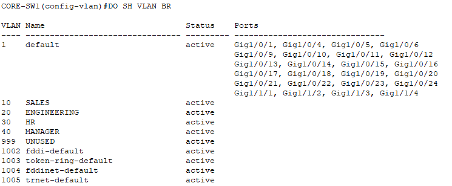
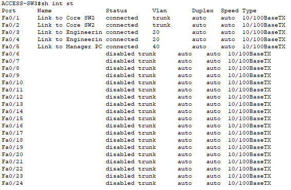
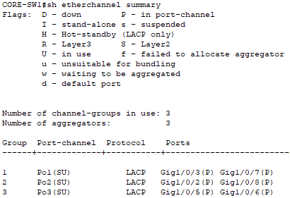
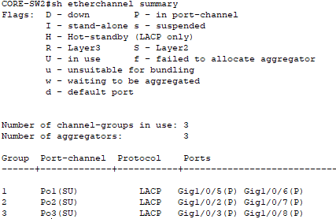
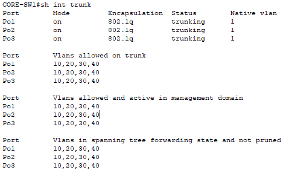
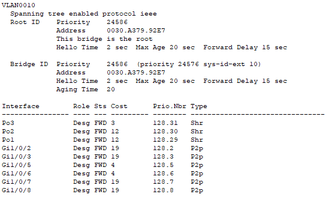
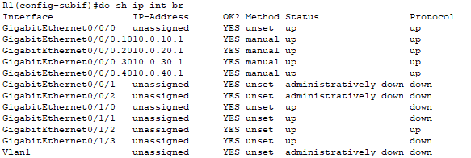
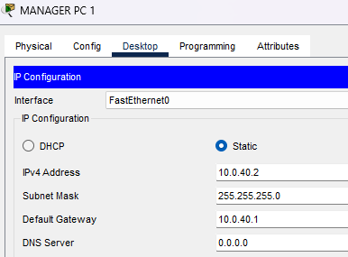

**Project Name:** 04-InterVLAN-Routing-Lab
**Version:** 1.0  
**Author:** Nicholas Williams  
**Date Created:** August 4th 2026  
**Last Updated:** August 6th 2026  
**Status:** Complete

# Objective

Build a redundant network using Layer 2 and Layer 3 switching concepts. 

## Goals

- Configure VLANs across multiple switches.
- Configure IEEE 802.1Q trunk links between switches.
- Implement Rapid PVST+ for loop prevention and redundancy.
- Configure EtherChannel using LACP for redundant switch connections.
- Configure PortFast and BPDU Guard on access ports.
- Verify VLAN propagation across trunk links.
- Verify STP root bridge selection and port states.
- Configure Layer 3 switching using multilayer switches.
- Create Switch Virtual Interfaces (SVIs) for VLAN gateways.
- Enable inter-VLAN routing between different VLAN networks.
- Verify routing between VLANs using Layer 3 switching.
- Troubleshoot VLAN, STP, EtherChannel, and routing issues.
---

# 2. Network Topology

## Topology Type

This topology uses a router-on-a-stick design for inter-VLAN routing. The access switches connect to the core switches using redundant trunk links with EtherChannel. The core switches provide Layer 2 switching, VLAN distribution, and RSTP redundancy. A router connects to the switching infrastructure through an 802.1Q trunk and provides routing between VLANs using router subinterfaces.


## Advantages

- Simple to configure and troubleshoot because routing occurs in one central location.
- A single router interface can provide gateways for multiple VLANs.
- 
## Limitations

- Limited scalability because all inter-VLAN traffic passes through one router interface
- No Layer 3 redundancy unless additional routers and gateway redundancy protocols are added

---

# 3. Physical Layout


## Devices

| Device | Model | Purpose |
|---|---|---|
| R1 | Cisco ISR 4331 | Router |
| CORE SW1 | Cisco 3560 Layer 3 Switch | Primary Core Switch |
| CORE SW2 | Cisco 3560 Layer 3 Switch | Secondary Core Switch |
| ACCESS SW1 | Cisco 2950 Switch | Access Layer Switch |
| ACCESS SW2 | Cisco 2950 Switch | Access Layer Switch |
| ACCESS SW3 | Cisco 2950 Switch | Access Layer Switch |
| ACCESS SW4 | Cisco 2950 Switch | Access Layer Switch |
| PC1-PC10| End Devices | User Connectivity Testing |

---

# 4. VLAN Design
## VLAN Assignments

| VLAN | Name | Network | Default Gateway | Purpose |
|------|--------------|---------------|----------------|----------------|
| 10 | SALES | 10.0.10.0/24 | 10.0.10.1 | User workstations and devices for the Sales department |
| 20 | ENGINEERING | 10.0.20.0/24 | 10.0.20.1 | User workstations and devices for the Engineering department |
| 30 | HR | 10.0.30.0/24 | 10.0.30.1 | User workstations and devices for the HR department |
| 40 | MANAGEMENT | 10.0.40.0/24 | 10.0.40.1 | Manager and executive user devices  |
| 999 | Unused VLAN | N/A | N/A | Unused native VLAN for trunk security |
---

## VLAN Addressing

| Device | VLAN | IP Address | Default Gateway |
|---|---|---|---|
| Manager PC 1 | VLAN 40 | 10.0.40.10/24 | 10.0.40.1 |
| Sales PC 1 | VLAN 10 | 10.0.10.10/24 | 10.0.10.1 |
| Sales PC 2 | VLAN 10 | 10.0.10.11/24 | 10.0.10.1 |
| Engineering PC 1 | VLAN 20 | 10.0.20.10/24 | 10.0.20.1 |
| Engineering PC 2 | VLAN 20 | 10.0.20.11/24 | 10.0.20.1 |
| Engineering PC 3 | VLAN 20 | 10.0.20.12/24 | 10.0.20.1 |
| Manager PC 2 | VLAN 40 | 10.0.40.11/24 | 10.0.40.1 |
| Engineering PC 4 | VLAN 20 | 10.0.20.13/24 | 10.0.20.1 |
| Engineering PC 5 | VLAN 20 | 10.0.20.14/24 | 10.0.20.1 |
| HR PC 1 | VLAN 30 | 10.0.30.10/24 | 10.0.30.1 |
| HR PC 2 | VLAN 30 | 10.0.30.11/24 | 10.0.30.1 |

# Gateway Design

The router provides inter-VLAN routing using a router-on-a-stick configuration. A single physical router interface connects to the core switching layer through an 802.1Q trunk. Each VLAN is assigned a router subinterface that acts as the default gateway for devices within that VLAN.

| VLAN | Name | Router Interface | Gateway IP Address |
|---|---|---|---|
| 10 | SALES | G0/0.10 | 10.0.10.1 |
| 20 | ENGINEERING | G0/0.20 | 10.0.20.1 |
| 30 | HR | G0/0.30 | 10.0.30.1 |
| 40 | MANAGEMENT | G0/0.40 | 10.0.40.1 |


# 5. Configuration order
The following order was used to configure VLANs, trunking, EtherChannels, and STP.
   ## 1. Configure basic switch settings
   - Set hostname
   - Configure basic management settings
   ```
   no ip domain-lookup 
   ```
   
          
   ## 2. Create VLANs on each switch
   ```
   vlan 10 
   name SALES 

   vlan 20 
   name ENGINEERING 

   vlan 30 
   name HR 
   
   vlan 40 
   name MANAGER

   vlan 999
   name UNUSED
   ```

   Verify:
   ```
   show vlan brief
   ```



   ## 3. Configure Access Ports
   ```
   interface range fa0/3 - 4
   switchport mode access 
   switchport access vlan 30
   ```

   Enable edge security:
   ```
   spanning-tree portfast
   spanning-tree bpduguard enable
   ```

   Verify:
   ```
   show interfaces status
   ```
 

   ## 4. Configure EtherChannels
   ```
   interface range g1/0/1-2
   channel-group 1 mode active
   ```
          
   Then configure the Port-Channel:   
   ```
   interface port-channel 1
   switchport mode trunk
   switchport trunk allowed vlan 10,20,30,40
   ```

   Verify Etherchannel and trunk:
   ```
   show etherchannel summary
   show interfaces trunk
   ```
    
   
   
  

          
   ## 7. Configure STP root and secondary root bridges
   Configure the primary root bridge on CORE1
   ```
   spanning-tree vlan 10,20,30,40 root primary
   ```
   Configure the secondary root bridge on CORE2
   ```
   spanning-tree vlan 10,20,30,40 root secondary
   ```
   
   Verify:
   ```
   show spanning-tree
   ```
   Core SW1:
   

   ## Configure Router-on-a-Stick
   ```
   interface g0/0
   no shutdown
   ```
   Subinterfaces:
   ```
   interface g0/0.10
   encapsulation dot1q 10
   ip address 10.0.10.1 255.255.255.0

   interface g0/0.20
   encapsulation dot1q 20
   ip address 10.0.20.1 255.255.255.0

   interface g0/0.30
   encapsulation dot1q 30
   ip address 10.0.30.1 255.255.255.0

   interface g0/0.40
   encapsulation dot1q 40
   ip address 10.0.40.1 255.255.255.0
   ```

   Verify:
   ```
   show ip interface brief
   ```

   


   ## Configure Static IP address


   
          
   ## 9. Verify configuration and save changes
   
   ### Verification of Vlan segmentation
   VLAN segmentation was verified by testing connectivity between end devices.  

   ### Same VLAN
   Sales PC → Sales PC

   


  ### VLAN Gateway
   Tests router connection.
   Sales PC → 10.0.10.1

   


   ### Inter-VLAN Routing
   HR PC → Engineering PC
   


# 6. Future Improvements
| Improvement | Description |
|---|---|
|Layer 3 Switching | Move inter-VLAN routing from the router to multilayer switches using Switch Virtual Interfaces (SVIs) |
| HSRP | Implement gateway redundancy by providing highly available default gateways for end devices. |
| OSPF | Connect multiple routed networks dynamically using an interior gateway routing protocol. |
| DHCP Relay | Allow centralized DHCP servers to provide IP addressing services across multiple VLANs. |