**Project Name:** 05-Layer3-Switching-HSRP-Lab
**Version:** 1.0  
**Author:** Nicholas Williams  
**Date Created:** August 8th 2026  
**Last Updated:** August 8th 2026  
**Status:** Complete

# 1. Objective
Upgrade the existing inter-VLAN routing infrastructure into a resilient Layer 3 network capable of maintaining gateway availability during device or path failures.

## Goals

- Configure VLANs across multiple switches.
- Configure IEEE 802.1Q trunk links.
- Configure Rapid PVST+ for Layer 2 redundancy.
- Configure LACP EtherChannels.
- Configure PortFast and BPDU Guard on access ports.
- Configure Layer 3 switching and SVIs.
- Enable inter-VLAN routing on the core switches.
- Configure HSRP for redundant default gateways.
- Configure a Layer 3 EtherChannel between core switches.
- Verify HSRP failover and inter-VLAN connectivity.
---

# 2. Network Topology

## Topology Type

This topology uses Layer 3 switching for inter-VLAN routing. Two multilayer core switches provide redundant SVIs and HSRP gateways, while access switches connect to both core switches using redundant trunk links.

## Advantages

- HSRP provides redundant default gateways if one core switch fails.
- Layer 3 switching provides faster inter-VLAN routing directly on the core switches.
- Layer 3 EtherChannel provides increased bandwidth and redundancy between core switches.
- The redundant core design improves overall network availability and scalability.
## Limitations

- The configuration is more complex than a router-on-a-stick design.
- The network requires multilayer switches capable of Layer 3 routing.
- Troubleshooting is more complex because multiple redundancy and routing technologies are involved.
- The redundant design requires additional hardware, links, and configuration.
---

# 3. Physical Layout


## Devices

| Device | Model | Purpose |
|---|---|---|
| CORE SW1 | Cisco 3560 Layer 3 Switch | Primary Core Switch |
| CORE SW2 | Cisco 3560 Layer 3 Switch | Secondary Core Switch |
| ACCESS SW1 | Cisco 2950 Switch | Access Layer Switch |
| ACCESS SW2 | Cisco 2950 Switch | Access Layer Switch |
| ACCESS SW3 | Cisco 2950 Switch | Access Layer Switch |
| ACCESS SW4 | Cisco 2950 Switch | Access Layer Switch |
| PC1-PC10| End Devices | User Connectivity Testing |

---

# 4. VLAN Design
## VLAN Assignments

| VLAN | Name | Network | Default Gateway | Purpose |
|------|--------------|---------------|----------------|----------------|
| 10 | SALES | 10.0.10.0/24 | 10.0.10.1 | User workstations and devices for the Sales department |
| 20 | ENGINEERING | 10.0.20.0/24 | 10.0.20.1 | User workstations and devices for the Engineering department |
| 30 | HR | 10.0.30.0/24 | 10.0.30.1 | User workstations and devices for the HR department |
| 40 | MANAGEMENT | 10.0.40.0/24 | 10.0.40.1 | Manager and executive user devices  |
| 999 | Unused VLAN | N/A | N/A | Unused native VLAN for trunk security |
---

## VLAN Addressing

| Device | VLAN | IP Address | Default Gateway |
|---|---|---|---|
| Manager PC 1 | VLAN 40 | 10.0.40.10/24 | 10.0.40.1 |
| Sales PC 1 | VLAN 10 | 10.0.10.10/24 | 10.0.10.1 |
| Sales PC 2 | VLAN 10 | 10.0.10.11/24 | 10.0.10.1 |
| Engineering PC 1 | VLAN 20 | 10.0.20.10/24 | 10.0.20.1 |
| Engineering PC 2 | VLAN 20 | 10.0.20.11/24 | 10.0.20.1 |
| Engineering PC 3 | VLAN 20 | 10.0.20.12/24 | 10.0.20.1 |
| Manager PC 2 | VLAN 40 | 10.0.40.11/24 | 10.0.40.1 |
| Engineering PC 4 | VLAN 20 | 10.0.20.13/24 | 10.0.20.1 |
| Engineering PC 5 | VLAN 20 | 10.0.20.14/24 | 10.0.20.1 |
| HR PC 1 | VLAN 30 | 10.0.30.10/24 | 10.0.30.1 |
| HR PC 2 | VLAN 30 | 10.0.30.11/24 | 10.0.30.1 |

# 5. Gateway Design

Inter-VLAN routing is provided by the Layer 3 core switches using Switch Virtual Interfaces (SVIs). Each VLAN has an SVI on both core switches, while HSRP provides a shared virtual default gateway for end devices.

The HSRP virtual IP is configured as the default gateway on all devices within the corresponding VLAN.

| VLAN | Name | CORE-SW1 SVI | CORE-SW2 SVI | HSRP Virtual Gateway|
|---|---|---|---|---|
| 10 | SALES | 10.0.10.2 | 10.0.10.3 | 10.0.10.1 |
| 20 | ENGINEERING | 10.0.20.2 | 10.0.20.3 | 10.0.20.1 |
| 30 | HR | 10.0.30.2 | 10.0.30.3 | 10.0.30.1 |
| 40 | MANAGEMENT | 10.0.40.2 | 10.0.40.3 | 10.0.40.1 |

# 6. Configuration order
The following order was used to configure VLANs, trunking, EtherChannels, Rapid PVST+, Layer 3 switching, and HSRP.   
   ## 1. Configure basic switch settings
   - Set hostname
   - Configure basic management settings
   ```
   no ip domain-lookup 
   ```
   
   ## 2. Create VLANs on each switch
   ```
   vlan 10 
   name SALES 

   vlan 20 
   name ENGINEERING 

   vlan 30 
   name HR 
   
   vlan 40 
   name MANAGER

   vlan 999
   name UNUSED
   ```

   Verify:
   ```
   show vlan brief
   ```
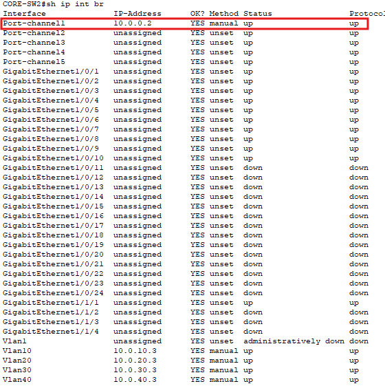


   ## 3. Configure Access Ports
   ```
   interface range fa0/3 - 4
   switchport mode access 
   switchport access vlan 30
   ```

   Enable edge security:
   ```
   spanning-tree portfast
   spanning-tree bpduguard enable
   ```

   Verify:
   ```
   show interfaces status
   ```
   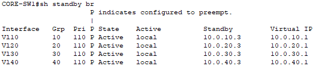

   ## 4. Configure EtherChannels
   ```
   interface range g1/0/1-2
   channel-group 1 mode active
   ```
          
   Then configure the Port-Channel:   
   ```
   interface port-channel 1
   switchport mode trunk
   switchport trunk allowed vlan 10,20,30,40
   ```

   Verify Etherchannel and trunk:
   ```
   show etherchannel summary
   show interfaces trunk
   ```
   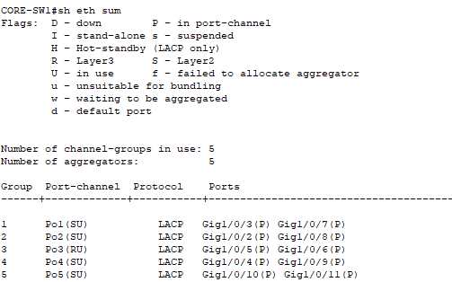
   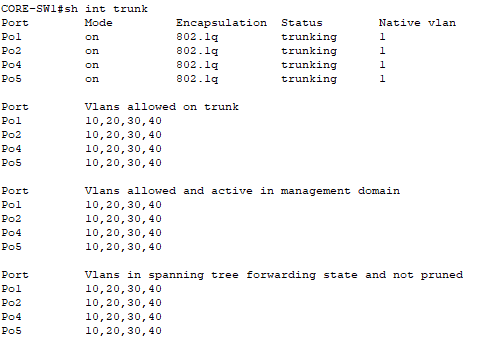
          
   ## 5. Configure STP root and secondary root bridges
   Configure the primary root bridge on CORE1
   ```
   spanning-tree vlan 10,20,30,40 root primary
   ```
   Configure the secondary root bridge on CORE2
   ```
   spanning-tree vlan 10,20,30,40 root secondary
   ```
   
   Verify:
   ```
   show spanning-tree
   ```
   Core SW1:
   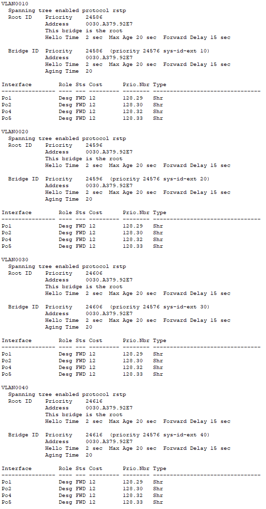

   Core SW2: 
   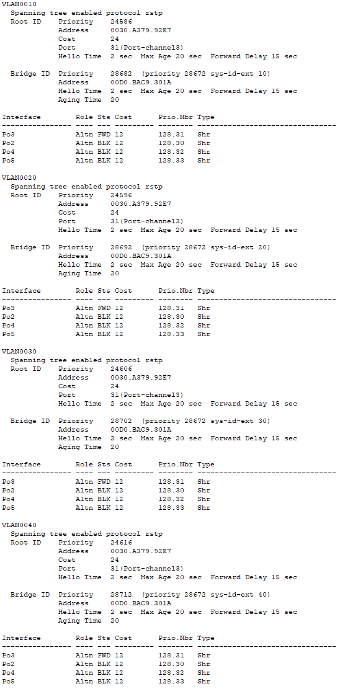

   Access SW1-4 are similar configurations:
   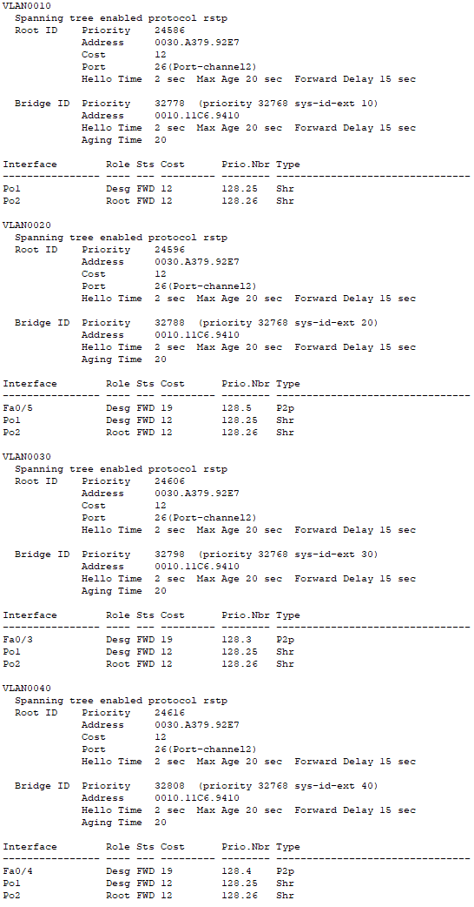

   ## 6. Configure Layer 3 EtherChannel

   Convert the core-to-core EtherChannel into a routed link.

   CORE-SW1
   ```
   interface range g1/0/5-6
   no switchport
   channel-group 10 mode active
   ```
   ```
   interface port-channel 10
   no switchport
   ip address 10.0.0.1 255.255.255.252
   no shutdown
   ```
   CORE-SW2
   ```
   interface range g1/0/5-6
   no switchport
   channel-group 10 mode active
   ```
   ```
   interface port-channel 10
   no switchport
   ip address 10.0.0.2 255.255.255.252
   no shutdown
   ```
   Verify:
   ```
   show etherchannel summary
   show ip interface brief
   ```
   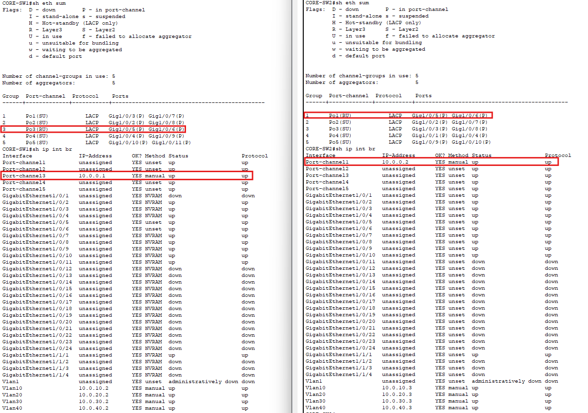

   ## 7. Configure SVIs 

   Enable Layer 3 routing:
   ```
   ip routing
   ```
   Configure the SVIs on CORE-SW1:
   ```
   interface vlan 10
   ip address 10.0.10.2 255.255.255.0
   no shutdown

   interface vlan 20
   ip address 10.0.20.2 255.255.255.0
   no shutdown

   interface vlan 30
   ip address 10.0.30.2 255.255.255.0
   no shutdown

   interface vlan 40
   ip address 10.0.40.2 255.255.255.0
   no shutdown
   ```
   Configure the SVIs on CORE-SW2 using the .3 addresses.

   Verify:
   ```
   show ip interface brief
   ```
   Core SW1:
   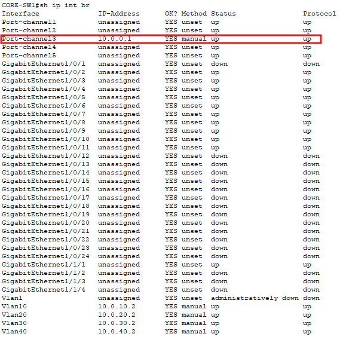

   Core SW2:
   
   
   ## 8. Configure HSRP

   Configure the HSRP virtual gateway on each SVI.

   Example for VLAN 10 on CORE-SW1:
   ```
   interface vlan 10
   standby 10 ip 10.0.10.1
   standby 10 priority 110 #Higher priority wins the Active role.
   standby 10 preempt
   ```
   On CORE-SW2:
   ```
   interface vlan 10
   standby 10 ip 10.0.10.1
   standby 10 priority 100 #Lower priority is assigned Standby role
   standby 10 preempt
   ```
   Repeat for VLANs 20, 30, and 40.

   Verify:
   ```
   show standby brief
   ```
   Core SW1:
   
   Core SW2:
   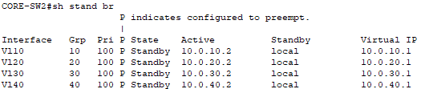

   ## 9. Configure End Devices
   Assign static IP addresses to PCs and use the HSRP virtual IP as the default gateway.
   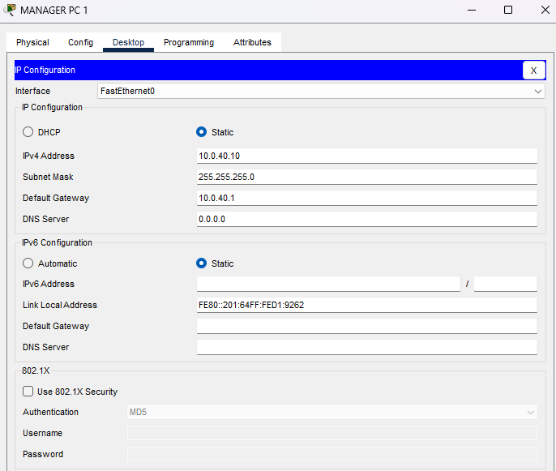

         
# 7. Verify configuration and save changes

### Verification of Vlan segmentation
VLAN segmentation was verified by testing connectivity between end devices.  

### Intra-VLAN
Sales PC → Sales PC


### Default Gateway
Tests router connection.
HR PC → VLAN 30 Gateway


### Inter-VLAN Routing
Engineering PC → Manager PC


### Test HSRP Failover

Verify the active and standby HSRP roles:
```
show standby brief
```
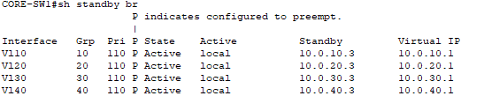
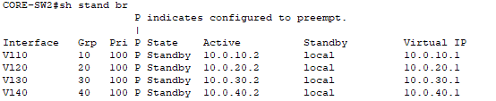

Shut down the active SVI or core switch and verify that the standby core assumes the virtual gateway.


Verify that connectivity remains available after failover.


# 8. Future Improvements
The local network is now segmented and resilient, but the organization is beginning to outgrow a single location.

A new branch office is planned, creating a requirement for users and services at different locations to communicate.

| Improvement | Description |
|---|---|
| Multi-Site Routing | Extend the existing infrastructure beyond the primary campus and connect a new branch network. |
| Static Routing | Initially connect multiple sites using manually configured routes to establish communication between remote networks. |
