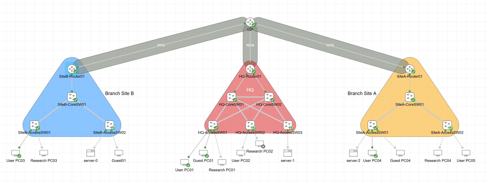
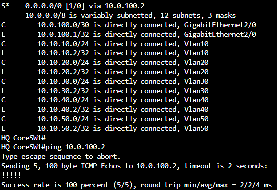
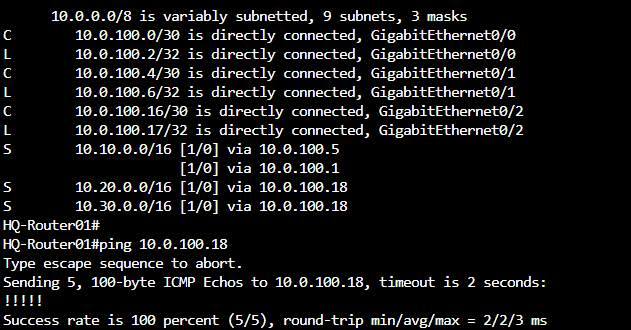
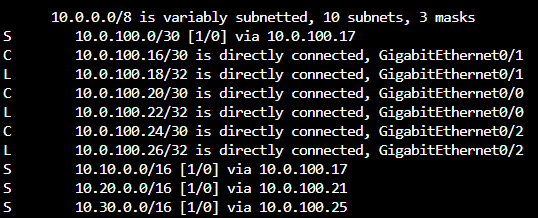
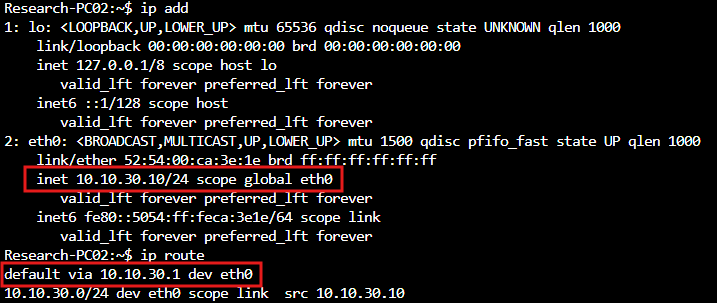
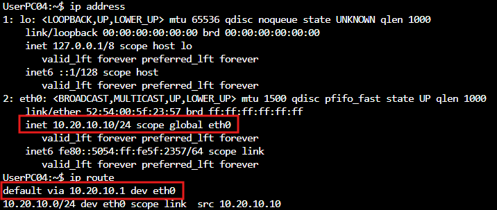
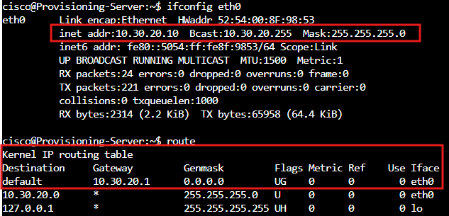

**Project Name:** 06-MultiSite-Static-Routing-Lab  
**Version:** 1.0  
**Author:** Nicholas Williams  
**Date Created:** August 12th 2026  
**Last Updated:** August 18th 2026  
**Status:** Completed

# 1. Objective

Extend the existing Williams Labs network by connecting the primary campus to additional branch locations using routed WAN links and static routing. The previous lab established a resilient Layer 3 campus network using Layer 3 switching, inter-VLAN routing, HSRP, Rapid PVST+, and EtherChannel. As the organization grows beyond a single location, the existing infrastructure must be extended to provide connectivity between geographically separate networks. This lab introduces routed WAN links and manually configured static routes while preserving the existing VLAN, Layer 3 switching, and HSRP infrastructure.

## Goals
- Extend the existing enterprise network to multiple locations.
- Configure routed WAN links between each site and a simulated ISP.
- Configure separate IP subnets for each site.
- Configure static routes between remote networks.
- Configure default routes where appropriate.
- Verify end-to-end connectivity between sites.
- Use `show ip route` to examine static and connected routes.
- Use `traceroute` to observe the path between sites.
---

# 2. Network Topology

## Topology Type

This topology extends the existing Layer 3 campus network into a multi-site environment. The primary campus retains the redundant Layer 3 core switches and HSRP configuration from Lab 5. Additional routers represent the WAN edge at each location and provide routed WAN connections to a simulated ISP. The ISP router provides transit connectivity between the geographically separate enterprise sites.

## Advantages
- Extends the existing enterprise network to multiple locations.
- Static routes provide predictable and deterministic routing.
- The routing table clearly demonstrates how routers learn remote networks.
- Routed WAN links provide a foundation for future dynamic routing protocols.
- The existing HSRP and Layer 3 campus design remains intact.

## Limitations
- Static routes must be manually configured and maintained.
- Adding additional sites increases the number of routes that must be managed.
- Changes to the topology require manual routing updates.
- Static routing does not automatically adapt to link failures.
- The design will become increasingly difficult to scale as additional locations are added.

---

# 3. Physical Layout



## Devices
```
<SITE>-<ROLE><NUMBER>
```
| Device | Model | Purpose |
|---|---|---|
| HQ-CoreSW01 | Cisco 3560 Layer 3 Switch | HQ Primary Core Switch |
| HQ-CoreSW02 | Cisco 3560 Layer 3 Switch | HQ Secondary Core Switch |
| SiteA-CoreSW01 | Cisco 3560 Layer 3 Switch | Site A Primary Core Switch |
| SiteB-CoreSW01 | Cisco 3560 Layer 3 Switch | Site B Primary Core Switch |
| HQ-AccessSW01 | Cisco 2950 Switch | HQ Access Layer |
| HQ-AccessSW02 | Cisco 2950 Switch | HQ Access Layer|
| HQ-AccessSW03 | Cisco 2950 Switch | HQ Access Layer |
| SiteA-AccessSW01 | Cisco 2950 Switch | Site A Access Layer |
| SiteA-AccessSW02 | Cisco 2950 Switch | Site A Access Layer|
| SiteB-AccessSW01 | Cisco 2950 Switch | Site B Access Layer |
| SiteB-AccessSW02 | Cisco 2950 Switch | Site B Access Layer|
| HQ-Router01 | Cisco Router | HQ Router |
| SiteA-Router01 | Cisco Router | Site A Router |
| SiteB-Router01 | Cisco Router | Site B Router |
| ISP-Router01 | Cisco Router | Simulated ISP / WAN Provider |

---

# 4. VLAN Design

## VLAN Assignments
| VLAN | Name | HQ | Site A | Site B |
|---:|---|---|---|---|
| 10 | USERS | 10.10.10.0/24 | 10.20.10.0/24 | 10.30.10.0/24 |
| 20 | SERVERS | 10.10.20.0/24 | 10.20.20.0/24 | 10.30.20.0/24 |
| 30 | RESEARCH | 10.10.30.0/24 | 10.20.30.0/24 | 10.30.30.0/24 |
| 40 | GUEST | 10.10.40.0/24 | 10.20.40.0/24 | 10.30.40.0/24 |
| 50 | NET-MGMT | 10.10.50.0/24 | 10.20.50.0/24 | 10.30.50.0/24 |
| 999 | BLACKHOLE | No subnet | No subnet | No subnet |

They're the same VLAN ID but different Layer-2 broadcast domains.

---
# 5. Site Addressing

The existing HQ networks are extended by adding separate networks for each branch.

## Site LANs

| Site | Network | Purpose |
|---|---|---|
| HQ | 10.10.0.0/16 | Existing enterprise VLANs |
| Site A | 10.20.0.0/16 | Site A LAN |
| Site B | 10.30.0.0/16 | Site B LAN |
| Infrastructure | 10.0.100.0/24 | Point to point connecting infrastructure|

## SVI IP Addressing Plan

## HQ SVI Addressing (HSRP Required)
For HQ, the endpoints will use the **.1** address as their default gateway. Core 01 will use **.2** and Core 02 will use **.3**.

| VLAN | Name | HQ Subnet | HQ Core 01 SVI IP | HQ Core 02 SVI IP | HSRP Virtual IP (Gateway) |
|:---:|---|---|---|---|---|
| 10 | USERS | 10.10.10.0/24 | 10.10.10.2 | 10.10.10.3 | **10.10.10.1** |
| 20 | SERVERS | 10.10.20.0/24 | 10.10.20.2 | 10.10.20.3 | **10.10.20.1** |
| 30 | RESEARCH | 10.10.30.0/24 | 10.10.30.2 | 10.10.30.3 | **10.10.30.1** |
| 40 | GUEST | 10.10.40.0/24 | 10.10.40.2 | 10.10.40.3 | **10.10.40.1** |
| 50 | NET-MGMT | 10.10.50.0/24 | 10.10.50.2 | 10.10.50.3 | **10.10.50.1** |

## Site A SVI Addressing (Single Core Switch)
For Site A, the SVI directly on the single core switch acts as the default gateway for the local endpoints.

| VLAN | Name | Site A Subnet | Site A Core SVI IP (Gateway) |
|:---:|---|---|---|
| 10 | USERS | 10.20.10.0/24 | **10.20.10.1** |
| 20 | SERVERS | 10.20.20.0/24 | **10.20.20.1** |
| 30 | RESEARCH | 10.20.30.0/24 | **10.20.30.1** |
| 40 | GUEST | 10.20.40.0/24 | **10.20.40.1** |
| 50 | NET-MGMT | 10.20.50.0/24 | **10.20.50.1** |

## Site B SVI Addressing (Single Core Switch)
For Site B, just like Site A, the SVI on the single core switch acts as the default gateway.

| VLAN | Name | Site B Subnet | Site B Core SVI IP (Gateway) |
|:---:|---|---|---|
| 10 | USERS | 10.30.10.0/24 | **10.30.10.1** |
| 20 | SERVERS | 10.30.20.0/24 | **10.30.20.1** |
| 30 | RESEARCH | 10.30.30.0/24 | **10.30.30.1** |
| 40 | GUEST | 10.30.40.0/24 | **10.30.40.1** |
| 50 | NET-MGMT | 10.30.50.0/24 | **10.30.50.1** |

> **Note on VLAN 999 (BLACKHOLE):** This VLAN has "No subnet." Therefore, you **do not** configure an `interface vlan 999` (SVI) for it on any of the core switches. It exists purely at Layer 2 as a place to park unused or unauthorized physical access ports so they cannot 

## Core ↔  Router Links
| Link | Network | Device A | Device B |
|---|---|---|---|
| HQ Core SW01 ↔ HQ Router01 | 10.0.100.0/30 | HQ Core SW01: 10.0.100.1 | HQ-Router01: 10.0.100.2|
| HQ Core SW02 ↔ HQ Router01 | 10.0.100.4/30 | HQ Core SW02: 10.0.100.5 | HQ-Router01: 10.0.100.6|
| Site A Core SW01 ↔ Site A Router01 | 10.0.100.8/30 | Site A Core SW01: 10.0.100.9 | SiteA-Router01: 10.0.100.10|
| Site B Core SW01 ↔ Site B Router01 | 10.0.100.12/30 | Site B Core SW01: 10.0.100.13 | SiteB-Router01: 10.0.100.14|

## Router ↔ ISP Links
| Link | Network | Device A | Device B |
|---|---|---|---|
| HQ ↔ ISP | 10.0.100.16/30 | HQ-Router01: 10.0.100.17 | ISP-Router01: 10.0.100.18 |
| Site A ↔ ISP | 10.0.100.20/30 | SiteA-Router01: 10.0.100.21 | ISP-Router01: 10.0.100.22 |
| Site B ↔ ISP | 10.0.100.24/30 | SiteB-Router01: 10.0.100.25 | ISP-Router01: 10.0.100.26|


---
# 6. Configuration Order

Recreate the [existing Lab 5 infrastructure](https://github.com/Nic-DevOps/Networking/blob/main/05-Layer-3-Routing-HSRP-Lab/README.MD) Access switches, VLANs, trunks, EtherChannel, SVIs, and HSRP as applicable, then extend it into the multi-site network. 

## 1. Basic site router configuration
Configure hostnames and no ip domain-lookup.

## 2. Configure Core-to-Router links
Assign the appropriate point-to-point /30 subnet to each link.
### HQ-Core01 → HQ-Router01
```
interface GigabitEthernet2/0
 description Link to HQ-Router01
 no switchport
 ip address 10.0.100.5 255.255.255.252
 no shutdown
```


Repeat the same configuration for each listed device pair, using the appropriate /30 subnet and IP addresses. Configure both ends and verify each link with ping.

## Configure Router-to-ISP links

### HQ-Router01 → ISP-Router01  


Repeat the same configuration for each listed device pair, using the appropriate /30 subnet and IP addresses. Configure both ends and verify each link with ping.


## Configure routes between the three sites through ISP-Router01.
HQ: 10.10.0.0/16  
Site A: 10.20.0.0/16  
Site B: 10.30.0.0/16  
Verify routing tables.
```
show ip route
```


## Configure branch end devices

### HQ Research PC  


### Site A User PC


### Site B Server



---

# 7. Verify Routing
### Traceroute from HQ User PC 10.10.10.10 to Site A Research PC 10.20.30.10


### Traceroute from Site A Guest PC 10.20.40.10 to Site B Server 10.30.20.10


---


# 8. Future Improvements

The multi-site network now provides connectivity between multiple locations, but the routing design introduces a new operational problem. Every remote network must be manually configured on the appropriate routers. As the organization adds more branches and redundant paths, the number of static routes will grow rapidly.

A change to the topology may also require administrators to manually update routing tables across multiple devices.


The next stage will replace the manually maintained routing relationships with **OSPF**, allowing routers to dynamically discover networks and calculate paths through the multi-site infrastructure.

| Improvement | Description |
|---|---|
| OSPF | Replace manually configured routes with dynamic routing so routers can automatically learn remote networks and adapt to topology changes. |
| OSPF Cost & Path Selection | Configure and examine OSPF metrics to understand how routers select preferred paths. |
| Route Summarization | Reduce the size of routing tables as the number of networks and locations grows. |
| WAN Redundancy | Add additional WAN paths between locations and allow dynamic routing to select an alternate path when a link fails. |
| DHCP Relay | Allow centralized DHCP services to provide addressing to hosts across the newly connected remote networks. |