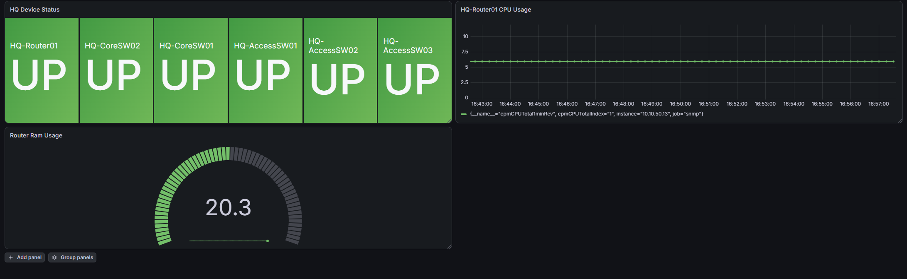
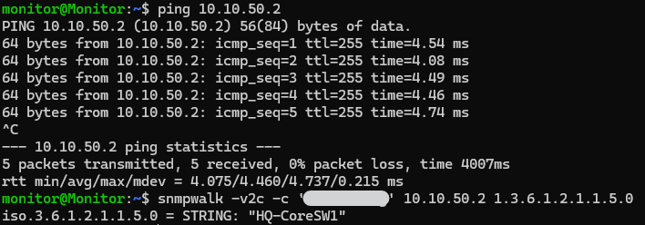

**Project Name:** 07-Network-Monitoring-with-Prometheus-and-Grafana
**Version:** 1.0  
**Author:** Nicholas Williams  
**Date Created:** August 20th 2026  
**Last Updated:** August 20th 2026  
**Status:** Completed

# 1. Objective

- Configure SNMP on Cisco switches and routers.
- Deploy Prometheus, SNMP Exporter and Grafana on the monitoring VM in the NET-MGMT VLAN.
- Configure Prometheus to collect SNMP metrics.
- Configure device display names and status mappings in Grafana


The monitoring infrastructure is built on the Debian 13 Monitoring VM and uses Prometheus to collect network metrics through the SNMP Exporter, with Grafana providing visualization.




## 2. Configure SNMP on Network Devices

Configure SNMP on the Cisco switches and routers using a consistent community string.

```
conf t 
snmp-server community <community-string> RO
```

Verify that the Monitoring VM can reach the devices and perform SNMP queries before continuing.
```bash
snmpwalk -v2c -c 'community-string' <device-ip> 1.3.6.1.2.1.1.5.0
```



A successful response confirms that the device is reachable, SNMP is enabled, the community string is correct, and SNMP queries are being returned.

# 3. Install Prometheus

Install Prometheus on the Monitoring VM.

### Create User and Directories
Set up a dedicated, non-login system user for Prometheus and create the directories needed for its configuration files and database.

```bash
sudo useradd --no-create-home --shell /bin/false prometheus
sudo mkdir -p /etc/prometheus /var/lib/prometheus
```

### Download and Extract
Download the latest stable release of Prometheus from GitHub and extract the archive into `/tmp`.
```bash
cd /tmp
wget https://github.com/prometheus/prometheus/releases/latest/download/prometheus-*.linux-amd64.tar.gz
tar -xvf prometheus-*.linux-amd64.tar.gz
```
### Install Binaries and Configuration
Copy the executable binaries to the system path, and move the web console templates and default configuration file into the `/etc/prometheus` directory.
```bash
sudo cp prometheus-*/prometheus prometheus-*/promtool /usr/local/bin/
sudo cp -r prometheus-*/consoles prometheus-*/console_libraries /etc/prometheus/
sudo cp prometheus-*/prometheus.yml /etc/prometheus/
```

### Set Ownership
Assign ownership of the binaries, configuration files, and data directory to the Prometheus user so the service has permissions to read and write to them.

```bash
sudo chown prometheus:prometheus /usr/local/bin/prometheus /usr/local/bin/promtool
sudo chown -R prometheus:prometheus /etc/prometheus /var/lib/prometheus
```

### Create the Systemd Service
Create a systemd service file to manage Prometheus as a background service.

```bash
sudo nano /etc/systemd/system/prometheus.service
```

Add the following configuration:

```ini
[Unit]
Description=Prometheus
Wants=network-online.target
After=network-online.target

[Service]
User=prometheus
Group=prometheus
Type=simple
ExecStart=/usr/local/bin/prometheus \
  --config.file=/etc/prometheus/prometheus.yml \
  --storage.tsdb.path=/var/lib/prometheus

[Install]
WantedBy=multi-user.target
```

### Start and Enable Prometheus
Reload the systemd manager to register the new service, then enable and start it immediately.

```bash
sudo systemctl daemon-reload
sudo systemctl enable --now prometheus
```

### Verify
Check that the service is running properly and that port `9090` is actively listening for traffic.

```bash
sudo systemctl status prometheus
sudo ss -tulpn | grep 9090
```

Prometheus should be available at:

```text
http://10.10.50.25:9090
```

# 4. Install SNMP Exporter
Install SNMP Exporter v0.30.1 on the Monitoring VM.

### Download and Extract
Download the SNMP Exporter release tarball and extract it into `/tmp`.
```bash
cd /tmp
wget [https://github.com/prometheus/snmp_exporter/releases/download/v0.30.1/snmp_exporter-0.30.1.linux-amd64.tar.gz](https://github.com/prometheus/snmp_exporter/releases/download/v0.30.1/snmp_exporter-0.30.1.linux-amd64.tar.gz)
tar -xzf snmp_exporter-0.30.1.linux-amd64.tar.gz
cd snmp_exporter-0.30.1.linux-amd64
```

## Create SNMP Exporter User
Create a dedicated system user for running the exporter safely.
```bash
sudo useradd --no-create-home --shell /bin/false snmp_exporter
```

## Install Binary and Configuration
Move the binary to the system path and place the default configuration file in `/etc/snmp_exporter`.
```bash
sudo mkdir -p /etc/snmp_exporter
sudo cp snmp_exporter /usr/local/bin/snmp_exporter
sudo cp snmp.yml /etc/snmp_exporter/snmp.yml
```

## Set Permissions
Secure the binary execution and limit configuration file ownership.
```bash
sudo chmod 755 /usr/local/bin/snmp_exporter
sudo chown root:snmp_exporter /etc/snmp_exporter/snmp.yml
sudo chmod 640 /etc/snmp_exporter/snmp.yml
```

## Configure SNMPv2c Authentication
Edit the SNMP Exporter configuration file:
```bash
sudo nano /etc/snmp_exporter/snmp.yml
```
Add the `monitoring_v2` authentication profile under `auths`:
```yaml
auths:
  monitoring_v2:
    community: monitoring
    security_level: noAuthNoPriv
    auth_protocol: MD5
    priv_protocol: DES
    version: 2
```

## Create the Systemd Service
Create a systemd service file to manage SNMP Exporter as a background service.
```bash
sudo nano /etc/systemd/system/snmp_exporter.service
```

Add the following configuration:
```ini
[Unit]
Description=Prometheus SNMP Exporter
Wants=network-online.target
After=network-online.target

[Service]
User=snmp_exporter
Group=snmp_exporter
Type=simple
ExecStart=/usr/local/bin/snmp_exporter \
  --config.file=/etc/snmp_exporter/snmp.yml

[Install]
WantedBy=multi-user.target
```

## Start, Enable, and Verify
```bash
sudo systemctl daemon-reload
sudo systemctl enable --now snmp_exporter
sudo systemctl status snmp_exporter
sudo ss -lntp | grep 9116
```
Test the exporter directly with HQ-CoreSW01:
```bash
curl "http://localhost:9116/snmp?module=if_mib&auth=monitoring_v2&target=10.10.50.12"
```

SNMP Exporter should be listening on:
```text
http://<Monitoring-VM-IP>:9116
```

# 5. Configure Prometheus
Edit the Prometheus configuration file:
```bash
sudo nano /etc/prometheus/prometheus.yml
```

Configure the SNMP Exporter as a Prometheus scrape target using the `monitoring_v2` module. The general structure is:
```yaml
scrape_configs:
  - job_name: 'snmp'
    static_configs:
      - targets:
          - 10.10.50.2
          - 10.10.50.3
          - 10.10.50.10
          - 10.10.50.11
          - 10.10.50.12
          - 10.10.50.13
    metrics_path: /snmp
    params:
      module:
        - monitoring_v2
    relabel_configs:
      - source_labels: [__address__]
        target_label: __param_target
      - source_labels: [__param_target]
        target_label: instance
      - target_label: __address__
        replacement: 127.0.0.1:9116
```
Add your specific Cisco device IP addresses to the target list.
## Validate the Prometheus Configuration
Before restarting Prometheus, validate the configuration syntax:
```bash
promtool check config /etc/prometheus/prometheus.yml
```
A successful validation should report:
```text
SUCCESS
```

Restart Prometheus and check the service status:
```bash
sudo systemctl restart prometheus
sudo systemctl status prometheus
```
## Verify Prometheus Targets
Open the Prometheus web interface in your browser:
```text
http://10.10.50.25:9090
```

Navigate to **Status → Targets** and verify that the devices appear as active targets. Each target should report a status of **UP**.

## Test Prometheus Metrics
Use the Prometheus expression browser to verify that metrics are being successfully collected.

Example queries:
* Test basic reachability: `up`
* Check SNMP interface operational status: `ifOperStatus`
* Check inbound interface traffic: `ifHCInOctets`
* Check outbound interface traffic: `ifHCOutOctets`

# 6. Install Grafana
Install Grafana on the Monitoring VM using the official Grafana Debian package repository.
### Add Grafana Repository
```bash
sudo apt-get install -y apt-transport-https wget gnupg
sudo mkdir -p /etc/apt/keyrings
sudo wget -O /etc/apt/keyrings/grafana.asc https://apt.grafana.com/gpg-full.key
sudo chmod 644 /etc/apt/keyrings/grafana.asc
echo "deb [signed-by=/etc/apt/keyrings/grafana.asc] https://apt.grafana.com stable main" | sudo tee /etc/apt/sources.list.d/grafana.list
```
### Install and Start Grafana
```bash
sudo apt-get update
sudo apt-get install -y grafana
sudo systemctl enable --now grafana-server
```
Verify that Grafana is listening:
```bash
sudo ss -tulpn | grep 3000
```
Grafana should be accessible at:
```text
http://10.10.50.25:3000
```

# 6. Add Prometheus to Grafana
Log into Grafana (`http://<monitoring-vm-ip>:3000`) and add Prometheus as a data source:

1. Navigate to **Connections → Data sources → Add new data source**.
2. Select **Prometheus**.
3. Set the URL to `http://localhost:9090`.
4. Click **Save & test** to verify the connection is successful.


## 7. Create the Network Monitoring Dashboard
Create the initial network monitoring dashboard in Grafana using Prometheus queries to populate the panels.  
The dashboard should monitor:
* Device availability
    ```promql
  up{job="snmp"}
* Interface status
    ```promql
    ifOperStatus{job="snmp"}
* Interface traffic (Inbound bytes/sec)
    ```promql
    rate(ifHCInOctets{job="snmp"}[5m])
* Bandwidth utilization
    ```promql
    rate(ifHCInOctets{job="snmp"}[5m]) * 8
* Interface errors
* Interface discards
* CPU utilization

* Memory utilization
  ```promql
  ciscoMemoryPoolUsed{job="snmp", ciscoMemoryPoolName="Processor"} / (ciscoMemoryPoolUsed{job="snmp", ciscoMemoryPoolName="Processor"} + ciscoMemoryPoolFree{job="snmp", ciscoMemoryPoolName="Processor"}) * 100

## Recommended Override Configurations

* **Display Names:** Rename obscure OID or interface strings (e.g., `ifDescr` or interface index IDs) into clear, standardized labels like `Core-SW01` or `Eth0/0`.
* **Units & Scaling:** Convert raw byte counters (such as `ifHCInOctets`) into readable bandwidth rates (`bits/sec` or `bytes/sec`) using Grafana's built-in unit conversions and rate calculations.
* **Decimal Precision:** Streamline data presentation by setting fixed decimal places (e.g., `2` decimal places for percentage values or bandwidth throughput).
* **Thresholds:** Establish visual color-coding rules (e.g., Green for normal, Yellow for warning, Red for critical) based on bandwidth saturation or packet error rates.
* **Value Mappings:** Translate raw numerical states (like `1` and `2`) into plain-text indicators such as `Up` and `Down`.
* **Interface-Specific Formatting:** Customize table or time-series panels to highlight specific trunk ports, uplinks, or error-prone interfaces dynamically.

# 8. Future Improvements
| Improvement | Description |
|---|---|
| Multi-Site Expansion | Set up local monitoring points or link setups together to track multiple locations (HQ, Site A, Site B) as the network grows. |
| Automatic Device Discovery | Switch from manually typing in IP addresses to automatically pulling new network devices straight from Netbox. |
| Automated Alerts | Add automated notifications so you get instant alerts if a device goes down or a network link fails across any location. |
