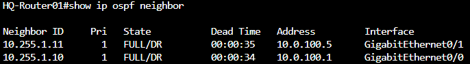
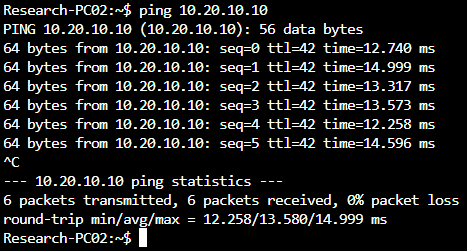

# Lab 8 — OSPF Dynamic Routing
**Project Name:** 08-OSPF-Dynamic-Routing-Lab
**Author:** Nicholas Williams  
**Date Created:** August 20th 2026  
**Last Updated:** August 25th 2026  
**Status:** Completed

# 1. Objectives
- Replace static routing with OSPF.
- Configure OSPF across the multi-site network.
- Establish OSPF neighbor relationships.
- Advertise LAN and WAN networks using OSPF.
- Verify OSPF-learned routes.
- Test automatic route convergence after a link failure.

---

# 2. Network Overview

Lab 8 uses the same multi-site topology from Lab 6, but replaces static routing with OSPF.

### Site LANs

| Site | Network | Purpose |
|---|---|---|
| HQ | `10.10.0.0/16` | Existing enterprise VLANs |
| Site A | `10.20.0.0/16` | Site A LAN |
| Site B | `10.30.0.0/16` | Site B LAN |
| Infrastructure | `10.0.100.0/24` | Point-to-point infrastructure links |

### Core ↔ Router Links

| Link | Network | Device A | Device B |
|---|---|---|---|
| HQ Core SW01 ↔ HQ Router01 | `10.0.100.0/30` | HQ Core SW01: `10.0.100.1` | HQ-Router01: `10.0.100.2` |
| HQ Core SW02 ↔ HQ Router01 | `10.0.100.4/30` | HQ Core SW02: `10.0.100.5` | HQ-Router01: `10.0.100.6` |
| Site A Core SW01 ↔ Site A Router01 | `10.0.100.8/30` | Site A Core SW01: `10.0.100.9` | SiteA-Router01: `10.0.100.10` |
| Site B Core SW01 ↔ Site B Router01 | `10.0.100.12/30` | Site B Core SW01: `10.0.100.13` | SiteB-Router01: `10.0.100.14` |

### Router ↔ ISP Links

| Link | Network | Device A | Device B |
|---|---|---|---|
| HQ ↔ ISP | `10.0.100.16/30` | HQ-Router01: `10.0.100.17` | ISP-Router01: `10.0.100.18` |
| Site A ↔ ISP | `10.0.100.20/30` | SiteA-Router01: `10.0.100.21` | ISP-Router01: `10.0.100.22` |
| Site B ↔ ISP | `10.0.100.24/30` | SiteB-Router01: `10.0.100.25` | ISP-Router01: `10.0.100.26` |


# 3. OSPF Design

All OSPF routing will use **Area 0**.

---

## Remove Static Routes
The static routes previously used for inter-site routing must be removed from the internal OSPF devices.

Do not remove the static routes from the ISP router. These routes are required to simulate the WAN and provide connectivity between the sites.

On each applicable internal device:
```bash
conf t
no ip route <destination-network> <subnet-mask> <next-hop>
```

Verify that the static routes have been removed:

```bash
show ip route static
```

Do not remove connected routes.

---

## Configure OSPF
To ensure stable OSPF adjacencies and clear identification, configure a Loopback0 interface on each device. Use the following addressing scheme for Loopback IPs and Router IDs: `10.255.<site>.<device>`. Configure OSPF process `1` on each participating router.


### Addressing Scheme
- `10.255.0.x` — ISP / Hub devices
- `10.255.1.x` — HQ (Routers & Core Switches)
- `10.255.2.x` — Site A (Routers & Core Switches)
- `10.255.3.x` — Site B (Routers & Core Switches)

### Assigned Loopback IPs & Router IDs

| Device | Loopback0 IP / Subnet | Router ID |
|---|---|---|
| HQ-Router01 | 10.255.1.1/32 | 10.255.1.1 |
| HQ-CoreSW01 | 10.255.1.10/32 | 10.255.1.10 |
| HQ-CoreSW02 | 10.255.1.11/32 | 10.255.1.11 |
| SiteA-Router01 | 10.255.2.1/32 | 10.255.2.1 |
| SiteA-CoreSW01 | 10.255.2.10/32 | 10.255.2.10 |
| SiteB-Router01 | 10.255.3.1/32 | 10.255.3.1 |
| SiteB-CoreSW01 | 10.255.3.10/32 | 10.255.3.10 |
| ISP-Router01 | 10.255.0.1/32 | 10.255.0.1 |


```bash
conf t
interface Loopback0
 ip address 10.255.1.1 255.255.255.255
router ospf 1
 router-id 10.255.1.1
```

**(Repeat this pattern for Site A and Site B OSPF device using their respective loopback IPs).*  

**Changing process IDs between routers isn't necessary unless you are intentionally trying to isolate two separate routing domains on the same physical hardware. Keeping process `router ospf 1` consistent across all routers and L3 switches simplifies your design.*  

---

## Configure Passive Interfaces

Prevent OSPF from attempting to form neighbor relationships with end devices.

Configure all interfaces as passive by default:

```bash
router ospf 1
passive-interface default
```

Then allow OSPF neighbors to form across router-to-router links:

```bash
no passive-interface <WAN-interface>
```

Verify:

```bash
show ip ospf interface brief
```

## Advertise OSPF Networks
Advertise the appropriate LAN, WAN, and Loopback networks on each router into Area 0.

### HQ-Router01

```bash
router ospf 1
network 10.10.0.0 0.0.255.255 area 0
network 10.0.100.0 0.0.0.3 area 0
network 10.255.1.1 0.0.0.0 area 0
```
<small>*Repeat this process for Site A and Site B.</small>  
<small>*Wildcard Masks: Unlike standard subnet masks, wildcard masks use `0` for exact bit matches and `1` to ignore bits—allowing broad ranges (e.g., `0.0.255.255`) or exact IPs (e.g., `0.0.0.0`).</small>


Verify the OSPF process:

```bash
show ip ospf
```

---

## 6. Verify OSPF Neighbors

Check the OSPF neighbor table:

```bash
show ip ospf neighbor 
```


OSPF neighbors should reach the `FULL` state.

If a neighbor does not reach `FULL`, verify:

- Interfaces are up/up.
- IP addresses are correct.
- Interfaces are in the same subnet.
- OSPF is enabled on both interfaces.
- Both interfaces are in the same OSPF area.
- Neither interface is configured as passive.
- OSPF network statements match the correct interfaces.

---


---

## 9. Test Inter-Site Connectivity

From HQ, test Site A:

```bash
ping <Site-A-IP>
```



## 10.  Verification

Run the following commands on each OSPF device:

```bash
show ip interface brief
show ip ospf
show ip ospf neighbor
show ip ospf interface brief
show ip route ospf
show ip route
```


## Expected Result

The multi-site network should operate without manually configured inter-site static routes.

OSPF should dynamically exchange routing information between the sites, populate the routing tables with OSPF-learned routes, and automatically update the routing table when a network path fails.


| OSPF Security Risk | Description | Future Lab Mitigation |
|---|---|---|
| **Rogue Adjacencies** | Unauthorized devices join the OSPF domain and inject false routes. | OSPF Authentication (MD5/SHA) |
| **Topology Disclosure** | Attackers intercept unencrypted routing updates to map your internal network. | Area Encryption & Control Plane Hardening |
| **DoS via Hello Flooding** | Excess traffic overwhelms the control plane, crashing the routing daemon. | Passive Interfaces & Prefix Filtering |


## 23. Future Improvements

| # | Improvement | Description |
|---|---|---|
| 1 | Add DHCP | Centralize IP address assignment and automate host configuration across the multi-site network. |
| 2 | Implement DNS | Provide centralized hostname resolution for infrastructure devices, servers, and network services. |
| 3 | Expand SNMP Monitoring | Monitor network device health, interfaces, traffic, and availability through SNMP, Prometheus, and Grafana. |
| 4 | Integrate Network Services with Monitoring | Monitor DHCP, DNS, and SNMP service availability and detect service failures through the existing monitoring stack. |
| 5 | Automate Network Service Deployment | Use Ansible and NetBox to standardize and automate the deployment and configuration of network services across sites. |