# Lab 09 — Network Services: DHCP

Project Name: 09-Network-Services-DHCP-Lab  
Author: Nicholas Williams  
Date Created: August 27th, 2026  
Last Updated: September 10th, 2026  
Status: In Progress  

# 1. Objectives

- Deploy a centralized DHCP server at HQ.
- Configure DHCP scopes for client VLANs.
- Configure DHCP relay using ip helper-address.
- Configure SSH on all switches and Routers
- Verify DHCP operation across multiple routed sites.
- Configure centralized network monitoring using Prometheus and Grafana.

# 2. Network Overview

Lab 09 builds on the multi-site OSPF infrastructure established in Lab 08.
DHCP is centralized at HQ in the Server VLAN. Remote client VLANs use DHCP relay to forward requests to the centralized server.

Site Networks Addressing convention: ` 10.<site>.<vlan>.<host>`

Site | Network
---|---
HQ | 10.10.0.0/16
Site A | 10.20.0.0/16
Site B | 10.30.0.0/16

VLANs

VLAN | Name | Purpose
---|---|---
10 | Users | User/client devices
20 | Servers | Servers and infrastructure services
30 | Research | Research systems
40 | Guest | Guest devices
50 | Net-Mgmt | Network management
999 | Blackhole | Unused/native VLAN protection


# 3. SSH Configuration

SSH was configured on Cisco switches and routers using local authentication and RSA keys.
```cisco
username admin privilege 15 secret <PASSWORD>  
ip domain-name williamslabs.local
crypto key generate rsa modulus 2048  
ip ssh version 2  

line vty 0 4  
 login local  
 transport input ssh  
 exit  
```

# 4. SNMP Configuration

SNMP was configured on Cisco switches and routers to allow Prometheus to collect network metrics.

```
conf t
snmp-server community monitoring RO  
```


# 5. DHCP Design

The DHCP server is located in the HQ Net-MGMT VLAN.

Setting | Value
---|---
Network | 10.10.50.0/24
DHCP Server | 10.10.50.22
Default Gateway | 10.10.50.1

The DHCP server uses a static IP address. VLANs receive addresses dynamically, while infrastructure devices retain static addresses.

DHCP Scopes

Site | VLAN | Network | Gateway
---|---|---|---
HQ | 10 | 10.10.10.0/24 | 10.10.10.1
HQ | 30 | 10.10.30.0/24 | 10.10.30.1
HQ | 40 | 10.10.40.0/24 | 10.10.40.1
Site A | 10 | 10.20.10.0/24 | 10.20.10.1
Site A | 30 | 10.20.30.0/24 | 10.20.30.1
Site A | 40 | 10.20.40.0/24 | 10.20.40.1
Site B | 10 | 10.30.10.0/24 | 10.30.10.1
Site B | 30 | 10.30.30.0/24 | 10.30.30.1
Site B | 40 | 10.30.40.0/24 | 10.30.40.1

Infrastructure addresses are excluded from DHCP pools.

# 6. DHCP Server Configuration
The DHCP server uses Kea DHCPv4 on Debian Linux to provide dynamic IP address allocation across the lab network.

Each DHCP scope defines:

- Network address and subnet mask.
- Dynamic address range.
- Default gateway.
- Lease duration.

DHCP relay configuration on the network switches and routers allows clients across HQ, Site A, and Site B to obtain addresses from the central server.

## DHCP Relay Configuration

DHCP relay is configured on the Layer-3 gateway for each DHCP-enabled VLAN.

Gateway Interface Configuration Example
```cisco
interface Vlan10  
 ip helper-address 10.10.50.22  
```

The same configuration is applied to VLANs 30 and 40, and to the corresponding gateways at Site A and Site B. Where HSRP is configured, the DHCP default gateway is the HSRP virtual IP.

## DHCP Config
```
dhcpadmin@HQ-DHCP01:~$ cat dhcp-config 
{
  "Dhcp4": {
    "interfaces-config": {
      "interfaces": [ "ens33" ]
    },

    "lease-database": {
      "type": "memfile",
      "persist": true,
      "name": "/var/lib/kea/kea-leases4.csv",
      "lfc-interval": 3600
    },

    "renew-timer": 900,
    "rebind-timer": 1800,
    "valid-lifetime": 86400,

    "subnet4": [

      {
        "id": 10,
        "subnet": "10.10.10.0/24",
        "pools": [
          {
            "pool": "10.10.10.10 - 10.10.10.254"
          }
        ],
        "option-data": [
          {
            "name": "routers",
            "data": "10.10.10.1"
          }
        ]
      },

      {
        "id": 30,
        "subnet": "10.10.30.0/24",
        "pools": [
          {
            "pool": "10.10.30.10 - 10.10.30.254"
          }
        ],
        "option-data": [
          {
            "name": "routers",
            "data": "10.10.30.1"
          }
        ]
      },

      {
        "id": 40,
        "subnet": "10.10.40.0/24",
        "pools": [
          {
            "pool": "10.10.40.10 - 10.10.40.254"
          }
        ],
        "option-data": [
          {
            "name": "routers",
            "data": "10.10.40.1"
          }
        ]
      },

      {
        "id": 210,
        "subnet": "10.20.10.0/24",
        "pools": [
          {
            "pool": "10.20.10.10 - 10.20.10.254"
          }
        ],
        "option-data": [
          {
            "name": "routers",
            "data": "10.20.10.1"
          }
        ]
      },

      {
        "id": 230,
        "subnet": "10.20.30.0/24",
        "pools": [
          {
            "pool": "10.20.30.10 - 10.20.30.254"
          }
        ],
        "option-data": [
          {
            "name": "routers",
            "data": "10.20.30.1"
          }
        ]
      },

      {
        "id": 240,
        "subnet": "10.20.40.0/24",
        "pools": [
          {
            "pool": "10.20.40.10 - 10.20.40.254"
          }
        ],
        "option-data": [
          {
            "name": "routers",
            "data": "10.20.40.1"
          }
        ]
      },

      {
        "id": 310,
        "subnet": "10.30.10.0/24",
        "pools": [
          {
            "pool": "10.30.10.10 - 10.30.10.254"
          }
        ],
        "option-data": [
          {
            "name": "routers",
            "data": "10.30.10.1"
          }
        ]
      },

      {
        "id": 330,
        "subnet": "10.30.30.0/24",
        "pools": [
          {
            "pool": "10.30.30.10 - 10.30.30.254"
          }
        ],
        "option-data": [
          {
            "name": "routers",
            "data": "10.30.30.1"
          }
        ]
      },

      {
        "id": 340,
        "subnet": "10.30.40.0/24",
        "pools": [
          {
            "pool": "10.30.40.10 - 10.30.40.254"
          }
        ],
        "option-data": [
          {
            "name": "routers",
            "data": "10.30.40.1"
          }
        ]
      }

    ]
  }
}
```

# 8. Prometheus and Grafana Monitoring

Prometheus and Grafana are configured to monitor network devices across HQ, Site A, and Site B.
Prometheus collects SNMP metrics through the SNMP exporter, while Grafana provides dashboards for visualizing device availability and health.


## Promethus Configuration

SNMP monitoring uses management IP addresses on VLAN 50. Prometheus targets are organized by site, and Grafana uses a site variable to filter devices.

```
monitor@Monitor:~$ cat prometheus.yml 
# my global config
global:
  scrape_interval: 30s # Set the scrape interval to every 15 seconds. Default is every 1 minute.
  evaluation_interval: 15s # Evaluate rules every 15 seconds. The default is every 1 minute.
  # scrape_timeout is set to the global default (10s).

# Alertmanager configuration
alerting:
  alertmanagers:
    - static_configs:
        - targets:
          # - alertmanager:9093

# Load rules once and periodically evaluate them according to the global 'evaluation_interval'.
rule_files:
  # - "first_rules.yml"
  # - "second_rules.yml"

# A scrape configuration containing exactly one endpoint to scrape:
# Here it's Prometheus itself.
scrape_configs:
  # Here it's Prometheus itself.
  - job_name: "prometheus"

    # metrics_path defaults to '/metrics'
    # scheme defaults to 'http'.

    static_configs:
      - targets: ["localhost:9090"]
        labels:
          app: "prometheus"

  - job_name: "snmp"
    metrics_path: /snmp
    params:
      module: [if_mib, cisco_device]
      auth: [monitoring_v2]

    static_configs:
    # HQ
    - targets:
        - "10.10.255.1"
      labels:
        site: "HQ"
        device: "HQ-Router01"

    - targets:
        - "10.10.50.2"
      labels:
        site: "HQ"
        device: "HQ-CoreSW1"

    - targets:
        - "10.10.50.3"
      labels:
        site: "HQ"
        device: "HQ-CoreSW2"

    - targets:
        - "10.10.50.10"
      labels:
        site: "HQ"
        device: "HQ-AccessSW01"

    - targets:
        - "10.10.50.11"
      labels:
        site: "HQ"
        device: "HQ-AccessSW02"

    - targets:
        - "10.10.50.12"
      labels:
        site: "HQ"
        device: "HQ-AccessSW03"


    # Site A
    - targets:
        - "10.20.255.1"
      labels:
        site: "Site A"
        device: "SiteA-Router01"

    - targets:
        - "10.20.50.1"
      labels:
        site: "Site A"
        device: "SiteA-CoreSW01"

    - targets:
        - "10.20.50.10"
      labels:
        site: "Site A"
        device: "SiteA-AccessSW02"

    - targets:
        - "10.20.50.11"
      labels:
        site: "Site A"
        device: "SiteA-AccessSW01"


    # Site B
    - targets:
        - "10.30.255.1"
      labels:
        site: "Site B"
        device: "SiteB-Router01"

    - targets:
        - "10.30.50.1"
      labels:
        site: "Site B"
        device: "SiteB-CoreSW01"

    - targets:
        - "10.30.50.10"
      labels:
        site: "Site B"
        device: "SiteB-AccessSW01"

    - targets:
        - "10.30.50.11"
      labels:
        site: "Site B"
        device: "SiteB-AccessSW02"


    # Hub
    - targets:
        - "10.0.255.1"
      labels:
        site: "Hub"
        device: "Hub-Router01"

    relabel_configs:
      - source_labels: [__address__]
        target_label: __param_target

      - source_labels: [__param_target]
        target_label: instance

      - target_label: __address__
        replacement: 127.0.0.1:9116

```

## Grafana configuration
The up metric is used to display device availability.

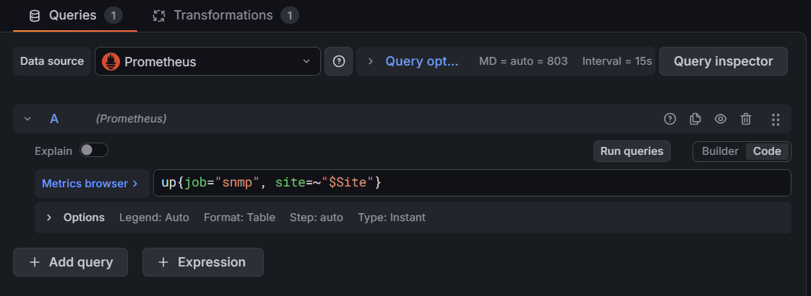

The Table visualization with a Organize fields by name Transformation is used to order the visual. 

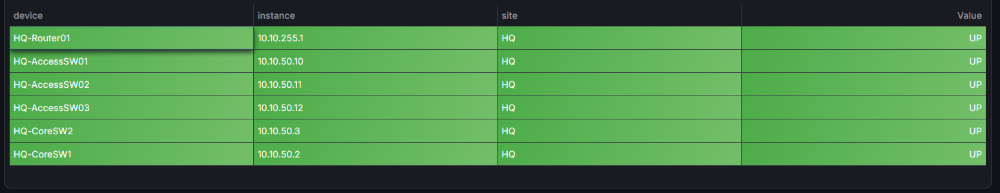
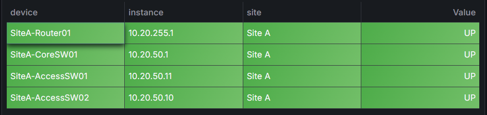
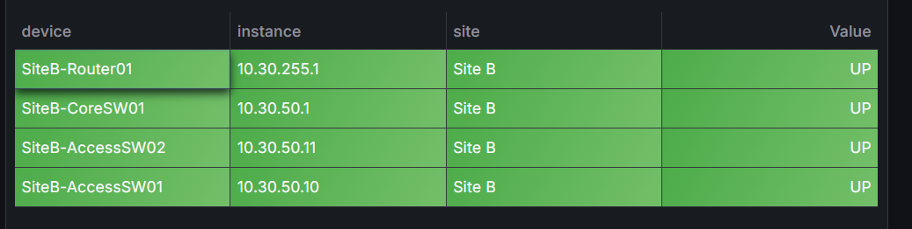


# 9. Verification and Testing


## Test DHCP

Configure a client to obtain its network configuration automatically.
Test one client in each site:

Site | Expected Network
---|---
HQ | 10.10.10.0/24
Site A | 10.20.10.0/24
Site B | 10.30.10.0/24

## HQ: 

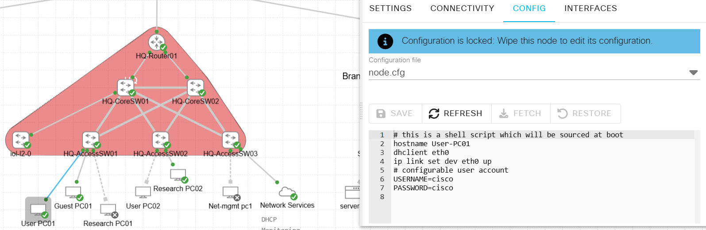

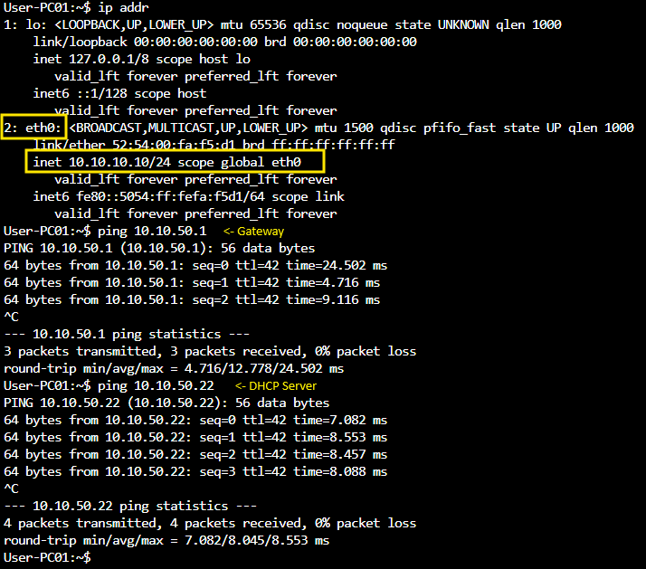

## Site A:

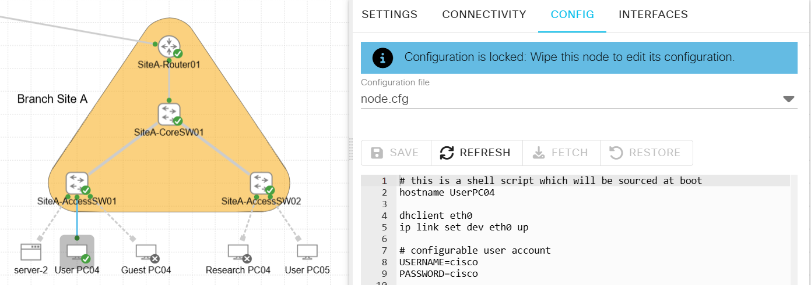


## Site B:


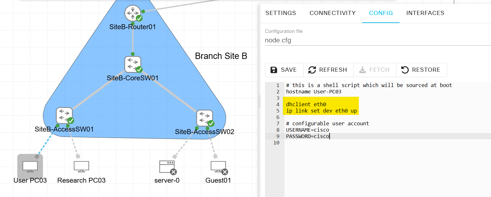

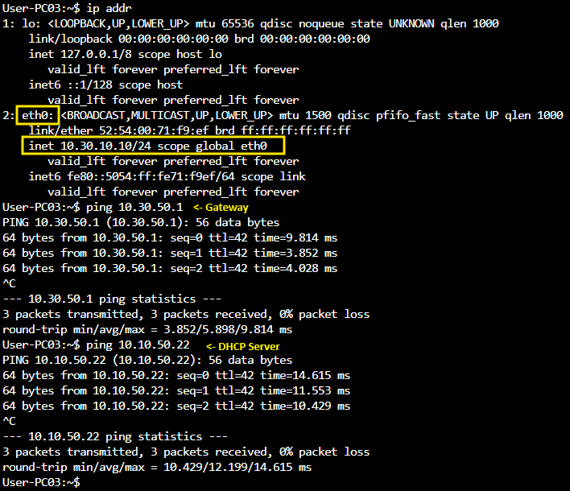


## DHCP Server Leases

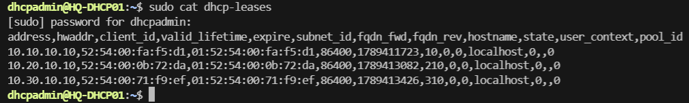


## Verify DHCP Relay

show running-config interface Vlan10  

Confirm that the correct ip helper-address is configured.


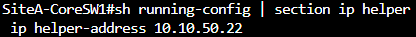


# 11. Summary and Future Improvements
- Configured SSH management across network devices, completing the core network-services and management components of Lab 09.
- Configured SNMP, Prometheus, and Grafana for network monitoring and visibility across the infrastructure.  
- Implemented centralized Kea DHCP across HQ, Site A, and Site B, with Cisco DHCP relay and OSPF providing connectivity to the DHCP server.  

## Future Improvements

Improvement | Description
---|---
DNS | Centralized hostname resolution.
DHCP High Availability | Redundant DHCP service.
DHCP Snooping | Protect access VLANs against rogue DHCP servers.
Expand Monitoring | Monitor DHCP service availability, leases, and failures.
NetBox Integration | Use NetBox as the source of truth for addressing and inventory.
Automation | Use Ansible to automate DHCP deployment.
DNS and DHCP Integration | Automatically register DHCP clients in DNS.