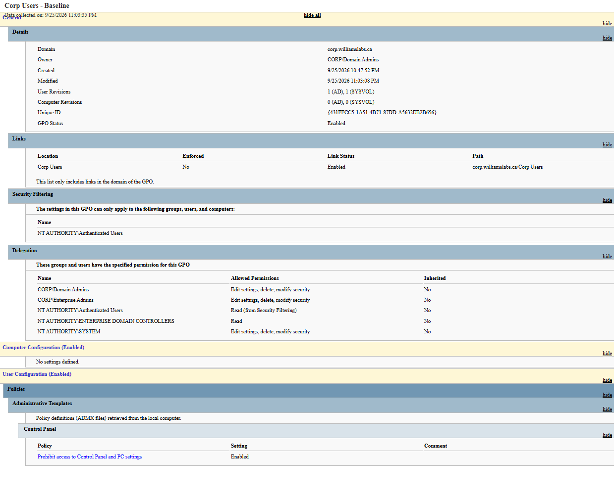
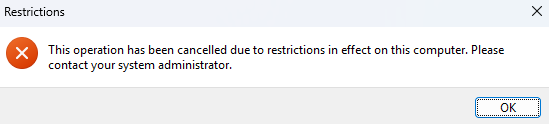

# Lab 10 — Active Directory Lab

Project Name: 10-Active-Directory-Lab
Author: Nicholas Williams
Date Created: September 19th, 2026
Last Updated: September 25th, 2026
Status: Complete

# 1. Overview

This lab stands up the first Active Directory Domain Services (AD DS) domain controller for WilliamsLabs. The domain controller, AD-01, runs Windows Server 2022 (evaluation) on VMware Workstation and joins the HQ server VLAN built out in Lab 06, giving the CML topology a real Windows AD environment to authenticate against. A Windows client on the HQ user VLAN is joined to the domain, and a user-scoped Group Policy Object (GPO) is applied to verify authentication and policy delivery end to end across VLANs.

This lab covers a single domain controller at HQ. A later lab will add a domain controller per CML site (Site A, Site B) and configure AD Sites and Services to match the physical topology.

# 2. Environment

Component | Value
---|---
Hypervisor | VMware Workstation
Server OS | Windows Server 2022 (evaluation)
Hostname | AD-01
Roles | AD DS, DNS
Network adapter | VMnet10, bridged to the HQ server VLAN (10.10.50.0/24), same segment as HQ-CoreSW01
Static IP | 10.10.50.50/24
Default Gateway | 10.10.50.1
DNS | Points at itself (AD-01 hosts the zone)
NetBox device | AD-01, listed under HQ
Test client | Windows client on the HQ user VLAN (VLAN 10), 10.10.10.100/24, connected via VMnet2

Addressing follows the lab's `10.<site>.<vlan>.<host>` convention. Within 10.10.50.0/24, hosts are allocated by range:

Range | Purpose
---|---
.1 – .9 | Core infrastructure
.10 – .49 | Network devices
.50 – .99 | Servers
.100 – .149 | Hosts / workstations
.150 – .199 | Reserved
.200 – .254 | DHCP pool

Clients sit on the user VLAN (10.10.10.0/24), not the server VLAN. Inter-VLAN routing between 10.10.10.0/24 and 10.10.50.0/24 is handled by SVIs on the HQ core switches (with HSRP, per Lab 06), so clients reach AD-01 through the core switches rather than sharing its subnet.

# 3. Objectives

- [x] Download Windows Server 2022 and build the VM in VMware
- [x] Configure base networking (hostname, static IP, gateway, DNS)
- [x] Promote the server to a domain controller (AD DS) with integrated DNS
- [x] Create an OU for users (Corp Users) and a test domain user
- [x] Join a client on the user VLAN to the domain
- [x] Create and link a user GPO
- [x] Verify authentication, DNS, and policy application across VLANs

# 4. Topology

TODO: Add topology diagram.

<!-- Images live in the shared assets folder: ../assets/10-Active-Directory-Lab/ -->

# 5. Steps

## 5.1 Network Configuration

The VM's adapter was moved off VMware's default NAT network onto VMnet10, which is bridged to the HQ server VLAN in CML. A static address was set before installing AD DS, since a domain controller should not rely on DHCP or an external DNS server:

```powershell
Get-NetAdapter
New-NetIPAddress -InterfaceIndex <ifIndex> -IPAddress 10.10.50.50 -PrefixLength 24 -DefaultGateway 10.10.50.1
Set-DnsClientServerAddress -InterfaceIndex <ifIndex> -ServerAddresses 127.0.0.1
```

## 5.2 AD DS Installation and Promotion

1. In Server Manager, **Add Roles and Features** → role-based install → select the local server → **Active Directory Domain Services** → install.
2. Use **Promote this server to a domain controller** (or `Install-ADDSForest`) to launch the AD DS Configuration Wizard.
3. Choose **Add a new forest** with root domain `corp.williamslabs.ca`.
4. Set the forest/domain functional level to Windows Server 2016 and install DNS on the same server.
5. Set the DSRM password (separate from any domain account) and record it securely.
6. Accept the NetBIOS name `CORP`, review the NTDS, log, and SYSVOL paths, and complete the install. The server reboots to finish promotion.

PowerShell equivalent:

```powershell
Install-ADDSForest `
  -DomainName "corp.williamslabs.ca" `
  -DomainNetbiosName "CORP" `
  -ForestMode "WinThreshold" `
  -DomainMode "WinThreshold" `
  -InstallDns:$true `
  -DatabasePath "C:\Windows\NTDS" `
  -LogPath "C:\Windows\NTDS" `
  -SysvolPath "C:\Windows\SYSVOL" `
  -SafeModeAdministratorPassword (ConvertTo-SecureString "<DSRM password>" -AsPlainText -Force) `
  -NoRebootOnCompletion:$false `
  -Force:$true
```

Parameter | Purpose
---|---
`-DomainName` | FQDN of the new forest root domain
`-DomainNetbiosName` | Short NetBIOS name (CORP)
`-ForestMode` / `-DomainMode` | Functional level; `WinThreshold` = Windows Server 2016
`-InstallDns` | Installs the DNS Server role alongside AD DS
`-DatabasePath` / `-LogPath` / `-SysvolPath` | Where the NTDS database, logs, and SYSVOL are stored
`-SafeModeAdministratorPassword` | DSRM password, passed as a secure string
`-NoRebootOnCompletion` | `$false` reboots automatically once promotion finishes
`-Force` | Suppresses confirmation prompts for unattended runs

## 5.3 Domain Configuration

Setting | Value
---|---
AD domain name | corp.williamslabs.ca
NetBIOS name | CORP
DC hostname | AD-01
User OU | Corp Users (test user `tuser1`)
Naming convention | Short hostnames (AD-01, AD-02, ...); site context is tracked in NetBox rather than in the domain name or hostname

Keeping site out of the domain name and hostname keeps the domain stable and portable, while NetBox remains the source of truth for which CML site each domain controller lives on.

## 5.4 Group Policy — Corp Users Baseline

A GPO named **Corp Users - Baseline** was created in the Group Policy Management Console and linked to the Corp Users OU:

1. Right-click the **Corp Users** OU → **Create a GPO in this domain, and Link it here…** → name it `Corp Users - Baseline`.
2. Edit the GPO → **User Configuration > Policies > Administrative Templates > Control Panel**.
3. Enable **Prohibit access to Control Panel and PC settings**.

This blocks standard users from changing system settings, a common baseline control for managed workstations.

GPO report (linked to Corp Users, link enabled, security filtering on Authenticated Users):



# 6. Verification and Testing

- [x] `Get-ADDomain` and `Get-ADForest` return the expected domain and forest from AD-01
- [x] `nltest /dsgetdc:corp.williamslabs.ca` returns AD-01 as the domain controller
- [x] DNS zone `corp.williamslabs.ca` exists on AD-01 and resolves AD-01 to 10.10.50.50
- [x] The client on the user VLAN (10.10.10.100) joins the CORP domain, reaching AD-01 via inter-VLAN routing
- [x] `dcdiag` passes all critical tests (Connectivity, Advertising, NetLogons, Replications, RidManager, Services); KccEvent reports standard LDAP-hardening advisories (signed binds, channel binding tokens), tracked as a future hardening item
- [x] SYSVOL and NETLOGON shares are published on AD-01
- [x] The Corp Users - Baseline GPO applies to domain users on the client

Commands run on the domain-joined client:

```powershell
# Confirm the signed-in identity and domain
whoami /fqdn
systeminfo | findstr /B /C:"Domain"

# Verify the secure channel (run elevated; Test-ComputerSecureChannel returns False when not elevated)
Test-ComputerSecureChannel -Verbose
nltest /sc_verify:corp.williamslabs.ca

# Confirm the client can resolve and reach AD-01 across VLANs
nslookup corp.williamslabs.ca
Test-NetConnection 10.10.50.50 -Port 389   # LDAP

# Confirm Group Policy is pulled from the domain
gpupdate /force
gpresult /r /scope user
```

Results:

- `whoami /fqdn` returns `CN=Test User1,OU=Corp Users,DC=corp,DC=williamslabs,DC=ca`, confirming the user lives in the Corp Users OU.
- `Test-ComputerSecureChannel` returns `True` and `nltest /sc_verify` reports `NERR_Success`.
- The client's DNS points only at 10.10.50.50, and its clock is within 0.1 s of AD-01 (well inside Kerberos's 5-minute tolerance).
- After `gpupdate /force`, opening Control Panel as `tuser1` is blocked by the Corp Users - Baseline GPO:



Together these confirm DNS, Kerberos authentication, and Group Policy are working end to end across the user (10.10.10.0/24) and server (10.10.50.0/24) VLANs.

# 7. Summary and Future Improvements

AD-01 is running as the forest root domain controller and DNS server for `corp.williamslabs.ca` on the HQ server VLAN. A client on a separate routed VLAN authenticates against it and receives user Group Policy, validating the Lab 06 inter-VLAN routing design for real Windows services.

## Future Improvements

Improvement | Description
---|---
Firewall | Put a firewall in front of the server VLAN, allowing only the ports AD needs (DNS 53, Kerberos 88, LDAP 389, SMB 445, RPC 135 and 49152–65535), and route AD-01's internet traffic via the hub router.
GPO baseline | Expand user and computer GPOs (screen lock, password/lockout policy, drive mappings) and add a Corp Computers OU.
Additional DCs | Add a domain controller per CML site (AD-02, AD-03, ...) for redundancy.
AD Sites and Services | Map each CML subnet (HQ, Site A, Site B) to its own AD site so replication and authentication follow the Lab 06 topology.
DNS design | Revisit once multiple DCs exist (conditional forwarders between sites over the WAN links).
LDAP hardening | Enforce LDAP signing and channel binding, clearing the dcdiag advisories.
DHCP Integration | Issue domain-aware DHCP options (DNS server, DNS suffix) from the Lab 09 DHCP server.
Certificate Services | Stand up AD CS for internal PKI.
Monitoring | Extend Prometheus/Grafana monitoring to the domain controller.
